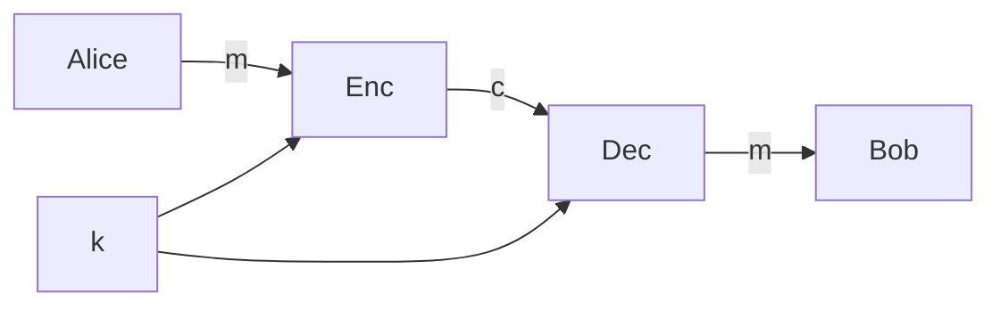

**provable security**: modern approach to critto

**prop1: confidentiality**
* A send $m$ to $B$
* if $E$ gets $m$, she cannot read it

**prop2**: **integrity**
* $A$ sends $m$ to $B$
* $E$ gets $m$ and sends $m'$ to $B$
* $B$ gets $m'$ and not $m$

vogliamo creare sistemi che rispettano prop1 e prop2.

**public key vs private key**:
* **pk critto**: e' rivoluzione! deppeffo!

## secret key
**unconditional security**: prove security witouth assumptions
* treatment (*trattazione*) due to Claude Shannon

**criptographic primitive**: encryption. this primitive allows **confidentiality**

* $k \in \mathcal K$: chiave condivisa tra $A$ e $B$, must be unpredictable.
* $m \in \mathcal M$ and $c \in \mathcal C$
* $\Pi = (\text{Enc}, \text{Dec})$.

**assumption**: $k$ uniformly random, unkown to **E**.

come cazzo fanno $A$ e $B$ a condividere $k$? idk.
come scelgo $k$ u.r.? randomness. deppeffo.

**assunzione**: everyone knwos $\Pi$, but no one should know $k$
* anche perche senno la sicurezza si basa sul fatto che nessuno deve rendere pubblici $\Pi$

**def**:
* $\text{Enc}: \mathcal K \times \mathcal M \to \mathcal C$
* $\text{Dec}: \mathcal K \times \mathcal C \to \mathcal M$

**correctness**: $\forall k \in \mathcal K: \text{Dec}(k, \text{Enc}(k,m)) = m$.
* ex: identitfy function is correct, but not secure.

**def. secure encrytpion for symmetric encryption**:
* **shannon**: gives a definition independent from any adversary $\mathcal A$ chosen.

**def. perfect secrecy**: 
* Let $M$ be a distribution on $\mathcal M$. definition holds for any distribution
* Let $K$ be a uniform distribution on $\mathcal K$
* Then $C = \text{Enc}(K,M)$ is a distribution.
	* $\text{Enc}$ is deterministic
* $\Pi$ is perfectly secret if 
	* for every $M$
	* for every $m\in \mathcal M$
	* for every $c \in \mathcal C$
* then $P[M=m]$ (a **priority** probability, that adversary know what the message sent by alice is, even befor alice wakes up)
* $P[M=m]=P[M = m | C=c]$ (a **posteriori**, that adversary know what the cypher text is).
	* cypher text doesn't tell anything about what $m$ looks like.

**does exists an algorithm that satisfies perfect secrecy**? yes, but at a high price.

**thm**: the following statements are equivalent to define perfect secrecy
1. perfect secrecy
2. $M,C$ independent distributions. $I(M,C)=0$
3. $\forall m,m' \in \mathcal M, \forall c \in \mathcal C$ then $Pr[\text{Enc}(K,m)=c] = Pr[\text{Enc}(K,m')=c]$
	1. if you look at $c$, then every $m\in \mathcal M$ has the same probability
	2. probability taken over $K$ u.r. (over $\mathcal K$)

> [!note] exercise
> understand better the definitions

**application of thm**: OTP (One time pad) achives perfect secrecy.
* $\mathcal K, \mathcal M, \mathcal C = \{ 0,1 \}^l$
* $\text{Enc}(k,m)= k \oplus m$
* $\text{Dec}(k,c) = k \oplus c$
* $k \oplus (k \oplus m) = m$: **correctness**

**cor**: OTP is perfect secrecy
* for any $m \in \mathcal M$ and $c \in \mathcal C$
* $P[\text{Enc}(k,m)=c] = P[K \oplus m = c] = P[K = c+m] = 2^{-l}$ 
	* because $K$ is u.r over $\mathcal K$
* **and**: $P[\text{Enc}(K,m')=c]=2^{-l}$ with $m' \in \mathcal M$ **fixed**! $\square$

**the limitations**:
1. length of $k$ same as $m$, becaus you have to do XOR.
2. **key can only be used once**: la sicurezza perfetta non prevede di poter riutilizzare la stessa chiave.
	1. $c_{1}=k \oplus m_{1}$
	2. $c_{2} = k \oplus m_{2}$
	3. $c_{1} \oplus c_{2} = m_{1} \oplus m_{2}\oplus k \oplus k = m_{1} \oplus m_{2}$
		1. i've learnt something new, so no perfect secrecy.

**problem**: perfect secrecy is too strong. It does not consider the fact that the adversary is human or a machine.
* perfect secrecy ha come conseguenza le due limitazioni viste.

**proof thm**: 
* $1 \to 2$: 
	* **perfect secrecy**: $\text{Pr}[M=m] = \text{Pr}[M=m|C=c]$
	* **per bayes**: $\frac{\text{Pr}[M=m \land C=c]}{\text{Pr}[C=c]}$
	* $\text{Pr}[M=m \land C=c]=\text{Pr}[M=m]\text{Pr}[C=c]$ because of **independency*
* $2 \to 3$:
	* $\text{Pr}[\text{Enc}(K,m)=c]=\text{Pr}[\text{Enc}(K,M) = c | M =m]$ (**sposto la condizione** su $M$)
	* $= \text{Pr}[C=c | M=m]$ (**by definition**)
	* $= \text{Pr}[C=c]$
	* **by the same steps**: $\text{Pr}[\text{Enc}(K,m')=c] = \text{Pr}[C=c]$
	* $\text{Pr}[\text{Enc}(K,m')=c] = \text{Pr}[\text{Enc}(K,m)=c]$
* $3 \to 1$:
	* we will first show $\text{Pr}[C=c | M=m] = \text{Pr}[C=c]$
	* $=\text{Pr}[C=c] = \sum_{m'} \text{Pr}[C=c \land M = m'] = \sum_{m'} \text{Pr}[C=c|M=m'] \cdot \text{Pr}[M=m']$
	* $=\sum_{m'} \text{Pr}[\text{Enc}(K,M)=c|M=m'] \cdot \text{Pr}[M=m']$
	* $=\sum_{m'} \text{Pr}[\text{Enc}(K,m')=c] \cdot \text{Pr}[M=m']$ i can switch $m'$ with an $m$.
	* $=\sum_{m'} \text{Pr}[\text{Enc}(K,m)=c] \cdot \text{Pr}[M=m']$ (**by property 3**)
	* $=\text{Pr}[\text{Enc}(K,m)=c] \underbrace{ \sum_{m'}\text{Pr}[M=m']}_{=1}$
	* $=\text{Pr}[Enc(K,m)=c]$
	* so $\text{Pr}[C=c]=\text{Pr}[C=c|M=m]$
	* by bayes: $\text{Pr}[M=m|C=c]\cdot \text{Pr}[C=c]=\text{Pr}[M=m \land \text{C=c}]$
	* $\text{Pr}[C=c|M=m]\cdot \text{Pr}[M=m]$
		* $\text{Pr}[M=m]=\frac{\text{Pr}[M=m|C=c] \text{Pr}[C=c]}{\text{Pr}[C=c|M=m]} = \text{Pr[M=m|C=c]}$

