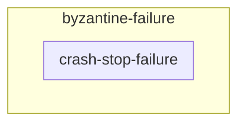
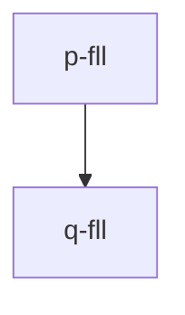
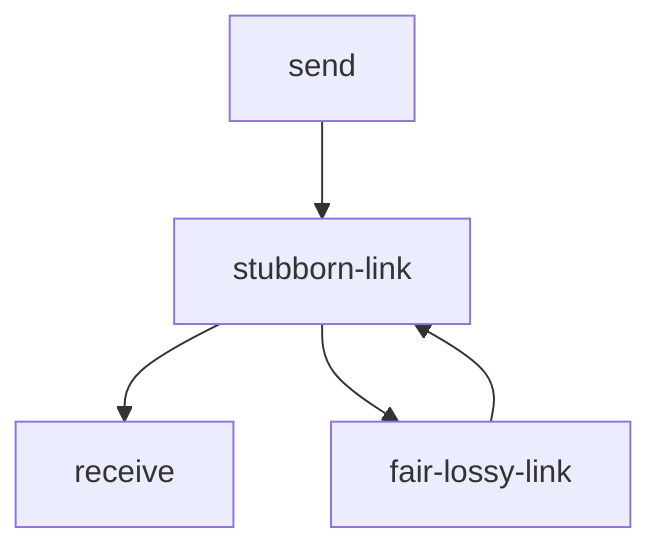

**synch vs asynch**:
* **syncrhony**: if there is a fixed bound on the delay of messages, on the execution time, bounf between the execution of actions.
	* **execution time**: each action takes at most $t \text{ms}$
* **asynch**: if there is
* **eventually-synchronous**: i can predict the delay most of the time.

> approfondisci avversario in sistemi sinch

## model of failures
* crasch-stop failure
* byzantine failure

**crash-stop failure**: segmentation fault for example.
* $\text{Crash}(p_{j})$: after this event, $p_{j}$ does not exists anymore
* $\star$
* un messaggio verso $\star$ e' perso, non c'e' un $p_{j}$ che lo riceve.

**assume**: if $p_{j}$ arrow stops earlier than others, then it crashed.

**note**: after $\text{Crash}$ $p_{j}$ cannot be restored

**byzantine failure**:
* $\text{Byz}(p_{j})$: after this event $p_{j}$ does not follow the algorithm anymore.
	* $p_{j}$ could also execute the original algorithm
	* corrupted by an adversary
	* $p_{j}$ acts like someone evil.

**example**: $\text{byz}=1$ algoritmo che e' resistante ad un processo $\text{Byz}$
* the algorithm also works with a **crash-stop failure**
* crash-stop failure is a byzantine that stops answering

* it's easier to manage crash-stop than byzantine
* $\text{Crash} \subseteq \text{Byzantine}$

**process correct**: if it does not fail

**problem**: there is no oracle at the start for correct process

$f$: max number of processes that can experience a faiulre.
* usually bound to $n-1$ or something else
* why $n-1$? if everyone dies there so concurrent system anymore.

# abstraction, pseudocode, algorithm
## abstraction and properties
1. define a system model
2. formalize a problem, with an abstraction
3. implement abstraction: write the distributed protocol
4. prove that protocol implements abstraction

abstracting communication link:
* informal description: connects $p$ with $q$ using a link with probability $\text{pr}$ loses messages (maybe because of noise), it can duplicate messages a finite number of times and it does not create messages from the air.
	* **example**: tcp does duplication
	* if receiver, recevise something from, then it was sent by someone, so the amount of error is not larger than the sent messages
* 2 **events**: exposing interface for p and q.
* **expected**: to send message from one side, and arrive it to the other side.
* **requests/input**: $<\text{Send}|q,m>$: send $m$ to $q$
* **indication/output**: $<\text{Deliver, p, m}>$: deliver $m$ from process $p$

properties: let's formalize the informal description. property specify something about an objetc
* FL1 (Fair-Loss): *if a correct process $p$ send message $m$ infinitely often to a correct process $q$, then $q$ delivers $m$ an infinite number of times.*
	* comes from: *connects $p$ with $q$ using a link with probability $\text{pr}$ loses messages*
	* we have to remove $\text{pr}$ from the definition, it cannot be arbitrary
		* **infinity**: rimpiazza $\text{pr}$, for any probability, it makes proof easier. it's an object that abstract $\text{pr}$.
* $\text{FL2 (Finite Duplication)}$: if a correct process $p$ sends $m$ a finite number of times to $q$, then $q$ cannot deliver $m$ an infinite number of times.
	* comes from: *it can duplicate messages a finite number of times*
	* **infinty**: we abstract using it
* $\text{FL3} (No creation)$: if some process $q$ delivers a message $m$ with sender $p$, then $m$ was sent by $p$ to $q$.

**fair-lossy link**:

**safety property vs liveness property**:
* **safety prop**: if the property is violated at time $t$ and it can never be satisfied after $t$
	* $E' \subseteq E$ after $t$: then $E'$ violates always safety property
	* $\text{FL3}$ is safety property, it should never be violated, the execution is violated forever for the receiver
		* $E=(e_{1},e_{2},e_{3})$
		* $E'=(e_{1},e_{2},e_{3}',e_{4}',\dots)$

**liveness property**: cannot be violated during the execution. it is liveness if given any finite execution $E$ that does not satisfy a liveness property ther is  an extension of E that satisfy it.
* means: something bad will happen
* $FL_{1}$ is liveness: 
	* it's not finite, we are talking about infinite messages
	* since it's not finite, eventually i can say that the message will ve receivbed

$\text{FL2}$ is liveness or safety?
* it's safety

**other prop**:
* **mutual exclusion**: if a process $p$ is granted a resource $r$ at time $t$, then no other process $q$ is granted $r$ at $t$
	* it's safety or liveness
* **no-deadlock**: if $r$ is not already granted, eventually get a grant on resource $r$
	* liveness
* **no-starvation**: if $p$ request a grant on $r$, it will eventually get it.
	* liveness

badly written prop:
* if $p$ send $m$ to $q$, then $q$ will eventually deilver it and this deilver is unique.
	* mixing:
		* liveness: $q$ will eventually deliver
		* safety: the deliver is unique 

if i say: if $p$ send $m$ to $q$, then $q$ will receive $m$ in 2 hours
* it's safety

# algorithm diocane
**fairy-lossy link**: how to remove the word **infinitely** from the properties?

**SL1**: if correct processes $p$ and $q$ are connected and $p$ sends $m$ to $q$, then $q$ delivers $m$ infinitely often.
* from FL1 e FL2

**reactive computing model**: manages events! peffo!
* write a set of event handler, a thread waiting for something maybe
* the handler can create new events
* **assumption**: handlers are atomic, otherwise it would be painful.
	* **crash**: can interrupt handlers.

**stubborn-link**:pseudocode
* send message an infinitely amount of time and receive ain infinitely amount
	* in fact loop over $\text{sent}$.
* we don't know 

$\text{FL3}$ is true, **proof**: assume false
* `deliver sl` violets $\text{FL3}$ only if `deliver dl` violats it

SL1 is true, **proof**: assume false
* `deliver sl` is triggered a finite amount of time only if `deliver fill` is triggered a finite amount
* we know/assume $p$ is **correct**, so `Timeout` is triggered a infinite amount of time

**SL1 is ugly**: it delivers too many messages. 

**PL (Perfect Link)**, guarantees that:
* PL1: if $p$ correct send $m$ to $q$, then $q$ eventually deilvers $m$
* PL2: a message is delivered at most once
* $\text{FL3}$: if some porcess $q$ delivers a messsage $m$ with sender $p$asdfadsf

