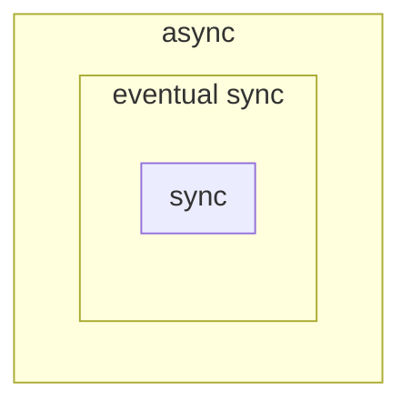

prop 1. me so rotto ercazzo
prop 2. samuele e' gay
prop 3. succhio cazzi

# fifo link
**problem for PP2P**: does not preserve order in wich messages are sent. if $m_{2}$ arrives before $m_{1}$ we should wait for $m_{1}$ before delivering $m_{2}$.

**FIFO property**: if a process $p$ delivers $m$ before $m'$, then $m$ was sent $m'$.
* this property applies to any sequence of messages, not just two messages $m$ and $m'$.
* **so it implies that the order of messages received is in order.**
* so this property must apply to any pair $m,m'$

**we want to build FIFO-link over PP2P-link:**
* **idea for the sender**: use a counter $t$ to attach to the messages. so we send $<m,t=0>$ for the first messages
	* then we send $<m',t=1>$
	* so on...
* **idea for the receiver**: enqueue out of order messages inside set $e$ of messages with $m$ and $t$.
	* receiver also needs a counter that tells the expected counter of the next incoming message
	* when i increase the counter i have to check if there are messages to deliver

**codice**:
1. upon event $<\text{fpl, Init}>$:
	1. $\text{pending} \gets \emptyset$
	2. forall $q\in \Pi$:
		1. $\text{seq[q]} \gets 0$
		2. $\text{next}[q] \gets 1$
2. upon event $<\text{fpl, Send}|q,m>$:
	1. $\text{seq[q]} \gets \text{seq}[q]+1$
	2. $\text{trigger} <\text{pl, Send}|q,[seq[q],m]>$

3. upon event $<pl, \text{Deliver}|s,[k,m]>$ do:
	1. $\text{pending} \gets \text{pending} \cup \{ (s,k,m) \}$
4. upon $\exists(s,k,m) \in \text{pending}$ such tat $k = \text{next}[s]$
	1. $\text{pending} \gets \text{pending} \setminus \{ (s,k,m) \}$
	2. $\text{next}[s] \gets \text{next}[s]+1$
	3. $\text{trigger} <\text{fpl}, \text{Deliver}|s,m>$
	   
**note**: we never send $\text{seq[0]}=0$, because we increment and then send.
**note**: $s$ is the source of Deliver
**note**: 4th event means if i receive a message from $s$ in which its sequence number is the same as the value i expected.

**show FIFO property**:
* assume we deliver $<m,t_{1}>$ and then $<m,t_{2}>$ with $t_{1}>t_{2}$.
* the only way to deliver $<m,t_{1}>$ is that $t_{1}=\text{next}[s]$
* now we increase $\text{next}[s]$
* but is not possible that $t_{2} = \text{next}[s]$

what if we remove $4.1$?
*  algorithm is still correct but keeps populating memory.

**exercise|EXAM**: what if $k= \text{next}[s]$ becomes $k \geq \text{next}[s]$?
* show why it violates and if it holds for every properties.

# time
**asynchronous**: there is no bound on the delay, on activation of processes, can be slow an so on...
* **models everything**: if i can model an asynchronous model then i can apply it everywere
* impossible to do agreement and other things

**syncrhonous**: there is a known bound. if send at $t$ then it will be received by $t+\Delta$ where $\Delta$ is known
* almost everything is possible
* models only restricted networks.

**eventually-synchronous**: there is a time , unkown to us, after wich time will be syncrhnous. most of the time we are synchronous ()

**example**: `ping`, most of the time you have a delay of $40ms \pm 10ms$. but suddenly you can get $700ms$ of delay.
* we must formalise: **most of the time**

guarda la slide figa:
* nelle sezioni sync: ho per esempio 40ms di delay
* nelle sezioni async: ho per esempio 7000ms di delay
* there's a delay **treshold supposed**: if above or below we change from sync to async and viceversa.

$T$: it's **unkown**, it's **stabilization** time. after this time $T$ we are **synchronous forever**.

**during asynch we may violate some properties**, so the algorithm becomes **wrong**.
* but eventually, we will enter the stabilization time, so the algorithm becomes correct (???)

we'll say: my algorithm workds under a certain trshold.

we don't even need to know how much is the treshold

* $\text{eventual sync}$ is $\text{async}$, but sometimes it's sync so async can solve it
* ...

## cock synchronisation in syncrhonous systems
**cock**: used to order events. order messages to decide next action
* you can attach the cock time to the messages. 
* when we could not distinguish two executions (remember examples), now we can.

**physical cocks**: how do we measure time?
* quartz oscillator
* software clock: $C_{i}(t)=aH_{i}(t)+ \beta$
	* if $H_{i}(t)$ pluses two times a second, then to count seconds we need
	* $\alpha=\frac{1}{2}$ 
* $\beta$ is used to synchronize the clock with other people.

$\text{Skew}_{i,j}(t) = \|C_{i}(t) - C_{j}(t)\|$: difference in time between two software clocks

**drift rate**: gradual misalignment of synch clocks caused by the slight inaccuracies of the time-keeping mechanisms.
* $\frac{d H(t)}{dt}=1$: perfect cock, no drifting
* $\frac{dH(t)}{dt}>1$: fast cock
* $\frac{dH(t)}{dt}<1$: slow cock

if we realize that the clock is fast, or slow we can adjust $\alpha,\beta$, but we cannot do it once, and forget about forever:
* if we make the cock faster, it becomes slower
* and viceversa.
* also: temperature modifies the way clock oscillates (es: quartz). 

**a cock is correct if**: $1-\rho \leq \frac{dH(t)}{dt} \leq 1+p$ with $\rho>0$, so it has an upper bound and a lower bound. $\rho$ depends on the cock

