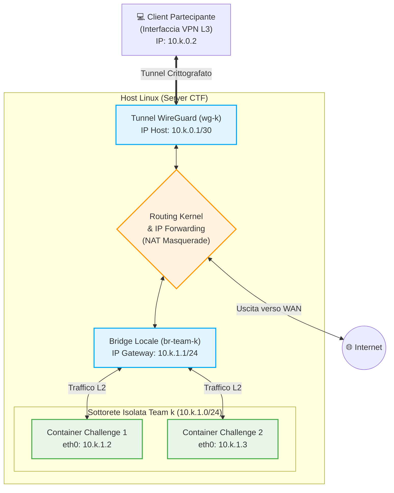

### 1. Diagramma Architetturale: Rete di Produzione (Team $k$)

Questo diagramma illustra l'ambiente "live", evidenziando il routing L3 tramite WireGuard e il bridging L2 per i container del team.

Snippet di codice

**Sintesi per la Tesi:**

  

- **Pregi:** Utilizzo esclusivo di primitive del kernel Linux (bridge, iptables/nftables, IP forwarding), garantendo overhead nullo, latenze minime e massima semplicità di implementazione. L'indirizzamento è omogeneo e deterministico in base all'ID del team ($k$).
- **Difetti:** L'infrastruttura richiede l'aggiornamento continuo delle tabelle di routing dell'host per ogni team. All'aumentare dei team, il proliferare di interfacce bridge (`br-team-k`) e tunnel (`wg-k`) potrebbe richiedere un tuning dei parametri del kernel per la gestione simultanea delle interfacce.
    
      
### 2. Diagramma Architetturale: Rete di Verifica (Ambiente Effimero)
Questo diagramma modella l'ambiente "sandbox" generato dinamicamente, evidenziando l'approccio a doppia interfaccia per scorporare il traffico locale da quello verso Internet.

```mermaid
flowchart TD
    Internet(("🌐 Internet"))

    subgraph Host["Host Linux &#40;Orchestratore Incus&#41;"]
        direction TB
        
        IncusBR["Bridge Pubblico &#40;incusbr0&#41;<br>Gateway DHCP & NAT verso WAN"]
        BRV["Bridge Effimero &#40;br-verify-l&#41;<br>Puro Switch L2 &#40;Nessun IP Host&#41;"]
        Checker["Container Checker<br>&#40;Esecutore Exploit&#41;"]

        subgraph ReteVerify["Ambiente Sandbox l-esimo &#40;Cloni a Freddo&#41;"]
            direction LR
            C1["Clone Challenge 1<br>eth0: 10.k.1.2<br>eth1: DHCP"]
            C2["Clone Challenge 2<br>eth0: 10.k.1.3<br>eth1: DHCP"]
        end
    end

    %% Connessioni per Internet (eth1)
    IncusBR <==>|Uscita NAT| Internet
    C1 <-.->|eth1 &#40;Default Route&#41;| IncusBR
    C2 <-.->|eth1 &#40;Default Route&#41;| IncusBR

    %% Connessioni per LAN Isolato (eth0)
    C1 <==>|eth0 &#40;LAN Statica&#41;| BRV
    C2 <==>|eth0 &#40;LAN Statica&#41;| BRV
    Checker <==>|Traffico di Valutazione| BRV

    %% Stili
    classDef interface fill:#e1f5fe,stroke:#03a9f4,stroke-width:2px;
    classDef container fill:#e8f5e9,stroke:#4caf50,stroke-width:2px;
    classDef checker fill:#ffebee,stroke:#f44336,stroke-width:2px;
    
    class IncusBR,BRV interface;
    class C1,C2 container;
    class Checker checker;
```

**Sintesi per la Tesi:**
- **Pregi:** Previene l'utilizzo di complessi strati di rete software-defined (come OVN). Elimina del tutto il rischio di collisioni di routing (IP overlap) con la rete di produzione poiché l'interfaccia `br-verify-l` non possiede un IP sull'host. Consente cicli di creazione e distruzione dell'ambiente estremamente rapidi.
- **Difetti:** L'ambiente di verifica diverge topologicamente da quello di produzione a causa della presenza della seconda interfaccia (`eth1`) e dello spostamento della _default route_. Questo disallineamento può causare falsi negativi se una patch o un exploit sono strettamente vincolati alla presenza del gateway originario (`10.k.1.1`) o alla singola interfaccia di rete.