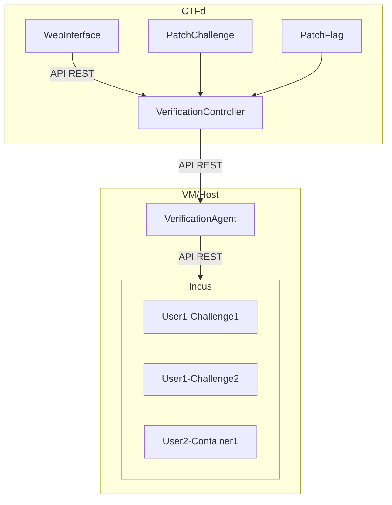
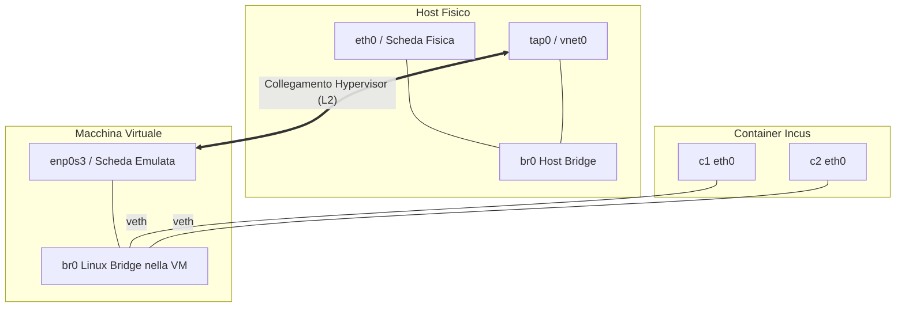
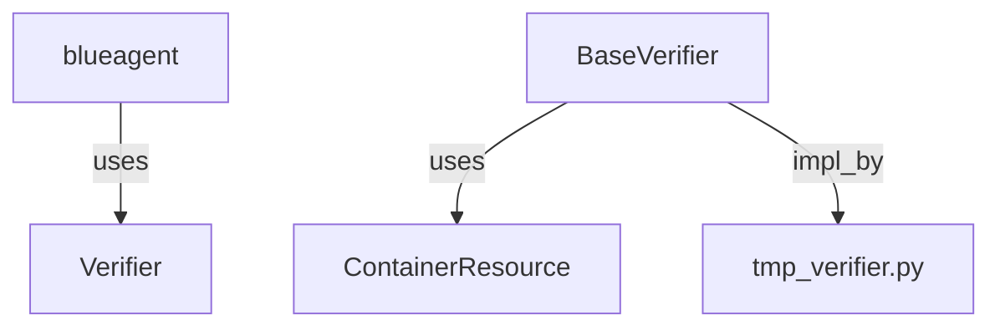
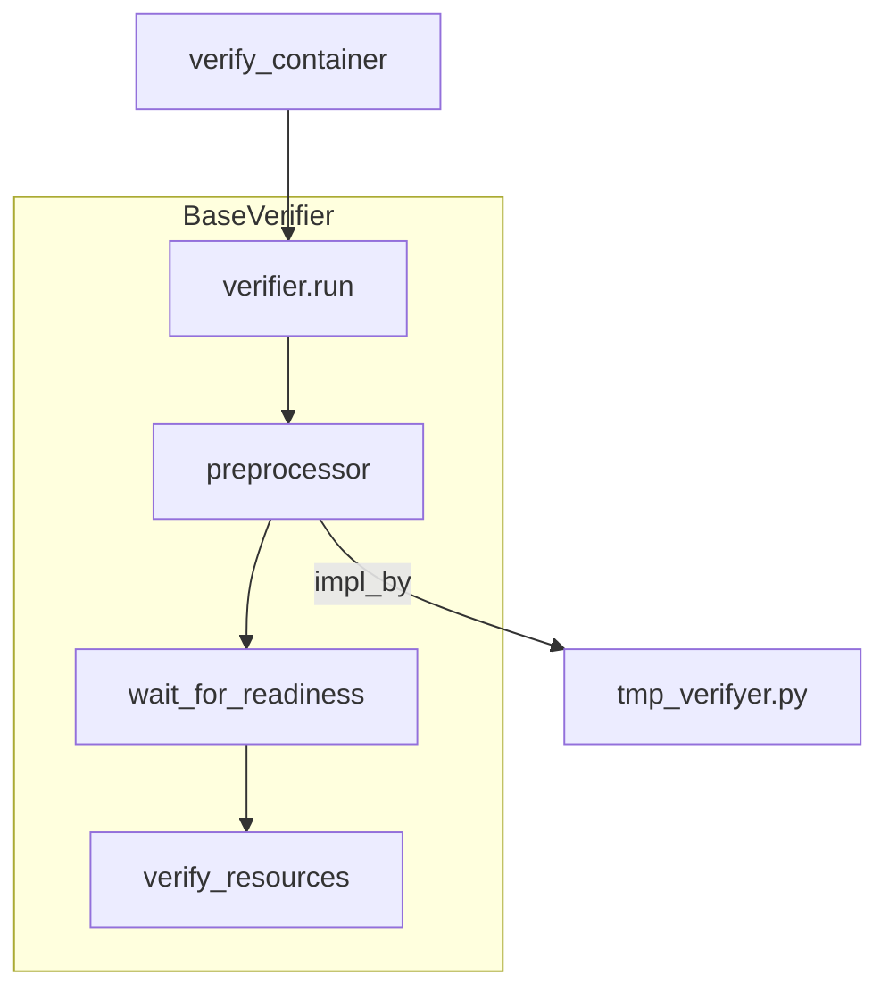
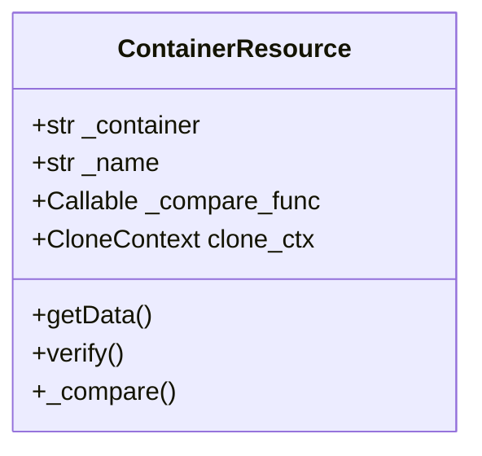
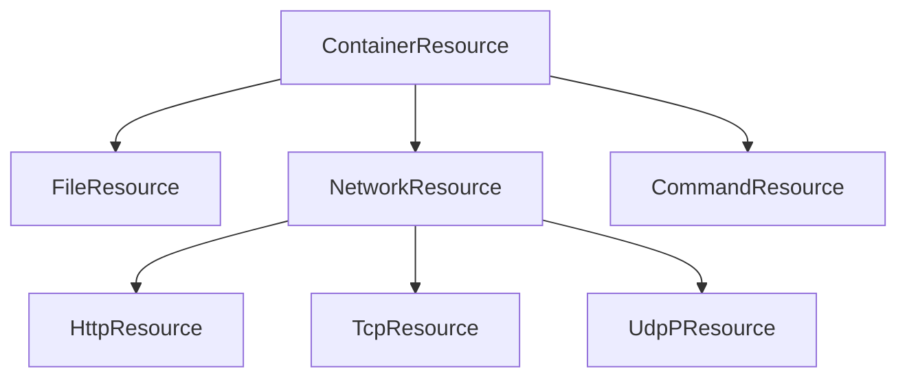

# introduzione
Il progetto pone l'obiettivo di creare una piattaforma per gestire challenge CTF di tipo Patching: data una macchina con dei servizi vulnerabili, bisogna modificare il sistema in esecuzione per ottenere una macchina "patchata".

**La sfida**: come identificare una macchina patchata? Per fornire una soluzione, abbiamo sviluppato un sistema modulare basato su python per definire 3 tipi di controlli possibili su una macchina:
* controlli di rete: controllo del comportamento di un servizio esposto in rete
* controlli su file: controllare il contenuto di determinati file rilevanti 
* controlli su file eseguibili: controllare che un file eseguibile esegua come dovrebbe.

**Definire una patch challenge**: ogni patch challenge e' definita a partire da un json descrittivo delle sue caratteristiche e da uno o piu file python, che determinano la logica per decidere se la macchina per un determinato tipo di challenge, e' stata patchata. 

> [!note] preprocessor e postprocessor
> La logica del check dovrebbe essere divisa in pre-processor e post-processor. Essenzialmente dividere in modo netto il codice ad alto livello che gestisce gli script degli autori delle challenge.

**Architettura dei container**: ad ogni utente, per ogni patch challenge corrisponde un container. Questi container sono eseguiti su una macchina virtuale con debian 13 che esegue incus, un gestore di container che supporta container "di sistema". I container sono esposti sulla rete locale grazie ad un bridge L2 impostato sulla macchia virtuale

**blueagent**: e' l'agente in esecuzione sulla macchina virtuale che intercetta le richieste di verifica sulle macchina. Risponde a domande del tipo:
* la macchina per la challenge 1 di utente pippo e' patchata?
* la macchina per la challenge 2 di utente pluto sta eseguendo?
Ed e' in grado di gestire l'esecuzione dei container di crearne altri qual'ora non esistono.

**CTFd**: e' un sistema, che gestisce competizioni di sfide Capture The Flag. Traccia punteggi per ogni singolo utente/team, e mostra le challenge disponibili. Comunica direttamente con blueagent per inoltrare i comandi utente e determinare se la flag per una determinata challenge e' stata ottenuta (ossia: se la macchina e' stata patchata). In particolare ho definito una classe di tipo PatchChallenge e PatchFlag per gestire le patch.

# architettura generale

* **nomi dei container**: per ora seguono il pattern `nomeutente-idchallenge`.
* **VerificationController**: implementato in `api.py` dentro `CTFd`

## bridge L2 (generato da gemini)

# verifiche

## tipi di verificatori

* `BaseVerifier`: e' l'interfaccia da implementare per scrivere un verificatore di challenge utilizabile da blueagent
* `ContainerResource`: e' l'interfaccia generale che astrae le risorse da verificare
* `tmp_verifier.py`: durante il processo di verifica deve essere inviato nella richiesta http, un file python da utilizzare. Questo file python deve contenere una classe che eredita da BaseVerifier e viene caricato a run time all'interno di un file temporaneo.
## struttura del processo di verifica

* `BaseVerifier.preprocessor`: e' la procedura da sovrascrivere per definire le proprie risorse da usare.
* `BaseVerifier.wait_for_reaidness`: e' la procedura che aspetta che le risorse siano verificate entro un certo timeout. utile per capire se la macchina clonata e' pronta per la verifica
	* **es**: la macchina ha un indirizzo ip disponibile?
	* **es**: un servizio e' stato avviato?
* `BaseVerifier.verify_resources`: e' la procedura che verifica le risorse e ritorna il risultato della verifica.
* `tmp_verifyer.py`: il file temporaneo, eredita BaseVerifier, e sovrascrive il comportamento di `preprocessor`.
## tipi di risorse da usare
**risorsa**: e' un dato, di qualsiasi tipo che puo' essere ottenuto tramite richiesta ad un container.
* `ContainerResource.getdata()`: interfaccia per ottenere i dati su cui la struttura opera
* `ContainerResource.compare(expected)`: questa interfaccia compara il dato ottenuto con `getdata`, con il valore `expected`. La logica per comparare deve essere definita da chi sviluppa la challenge
* `ContainerResource.verify`: questa procedura chiama `getdata` e successivamente `compare` e ne ritorna l'esito.

* `clone_ctx`: gestisce il contesto, per eseguire, avviare, e distruggere il clone di un container per la verifica.

* `FileResource`: interfaccia per  un dato che viene ottenuto a partire da un file recuperato da un container.
* `HttpResource`: interfaccia per un dato che viene ottenuto a partire da una richiesta di rete HTTP.
* `TcpResource`: interfaccia per un dato che viene ottenuto a partire da una richiesta TCP
* `UdpResource`: interfaccia per un dato che viene ottenuto a partire da una richiesta UDP
* `CommandResource`: interfaccia per un dato che viene ottenuto a partire da un comando eseguito sul container. 
	* `CloneContext`: questa risorsa funziona solo se viene fornito un `clone_ctx` valido.
	* **perche**? per evitare che i comandi eseguito siano visibili nel container, prima dell'esecuzione il container viene clonato, ed il suo contesto deve trovarsi in `clone_ctx`

**a che servono**? posso astrarre in questo modo come si ottengono le risorse dai container e come si verifica la validita della risorsa per determinare se il container e' stato patchato.

## cloni
`BaseVerifier.conf_use_clone`: con questa procedura si abilita la clonazione del container sorgente, da verificare. Questo container sara il target per le `CommandResource`.
* **come si usa**? nell'`__init__` del verificatore, si richiama `self.conf_use_clone`
* **che cosa comporta**? al momento della verifica viene creato un'oggetto `CloneContext` che si occupa di gestire il ciclo  vitale del container

`CloneContext`: eredita da `AbstractContextManager`
* **conseguenza**: e' pensato per essere utilizzato esclusivamente all'interno di un with, cosi si evitano container clonati che non vengono piu distrutti in caso di errore.

# cosa manca?
in sviluppo:
* limitare le risorse usabili dal container tramite impostaizoni incus
* lettura della configurazione `json`
	* possibilita di specificare un container
		* **perche**: posso fare in modo che piu challenge condividano lo stesso container.
* configurazione di utenti e password all'avvio

* autenticazione tra `CTFd` ed `blueagent`
* come gestire i container effimeri morti per qualche motivo?
	* inserire TTL/GarbageCollector
* distruzione dei container dopo l'eliminazione di una patch da `CTFd` 
* test multi utente: che succede al sistema quando piu utenti lo usano contemporaneamente?
* **async**: bisogna rendere asincrona la gestione delle rotte.

| Priorità       | Area                      | Azione Consigliata                                                                 |
| -------------- | ------------------------- | ---------------------------------------------------------------------------------- |
| 🔴 **Critica** | **TTL & Cleanup**         | Evitare che i container dimenticati saturino RAM e disco dell'host.                |
| 🔴 **Critica** | **Subnet Incus**          | Allargare la subnet di `incusbr0` oltre la `/24`.                                  |
| 🟠 **Alta**    | **I/O Asincrono**         | Convertire `IncusClient` in `httpx.AsyncClient` per sbloccare la concorrenza HTTP. |
| 🟠 **Alta**    | **Resource Quotas**       | Limitare CPU, RAM e processi massimi nei profili Incus delle challenge.            |
| 🟡 **Media**   | **Locking per Container** | Gestire la mutua esclusione sulle transizioni di stato (`start`/`stop`/`delete`).  |
