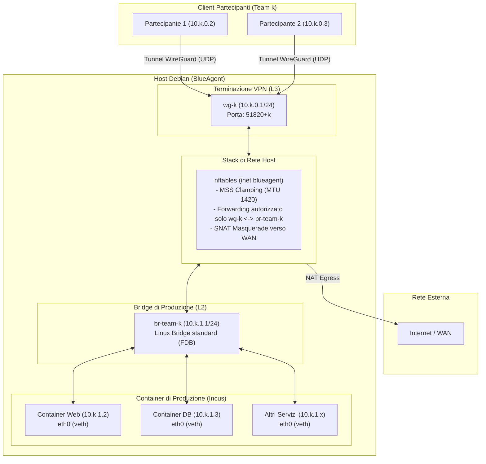
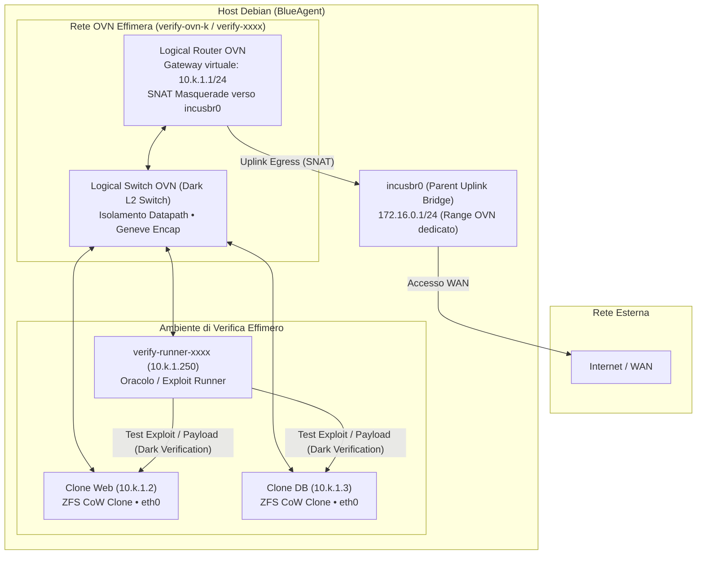
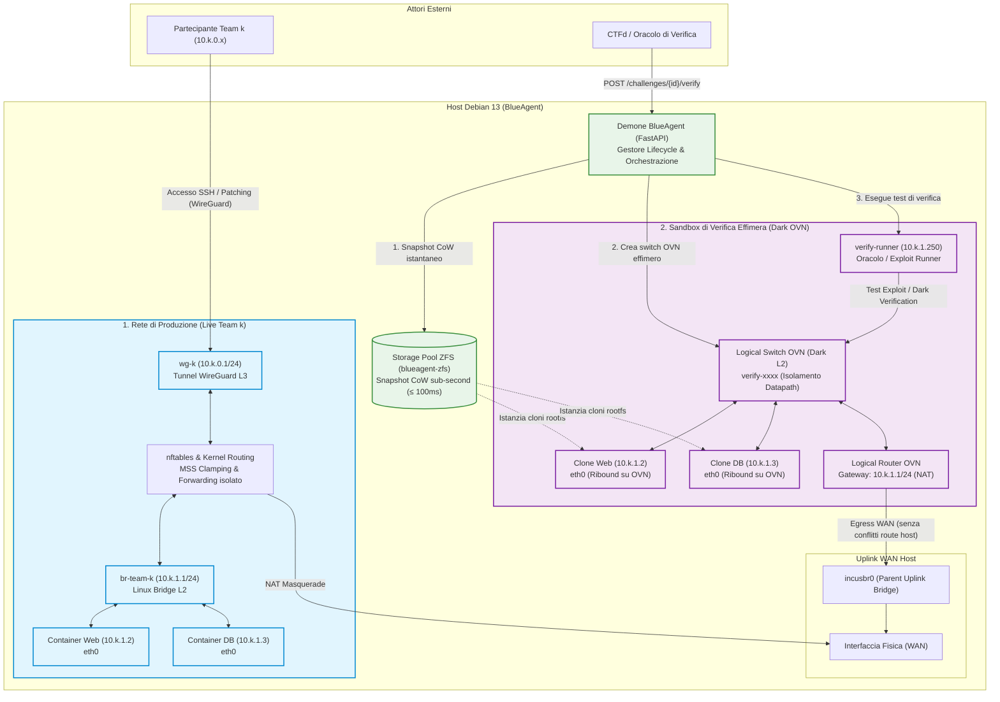

# architettura
Sia $k\in[0,\dots,n-1]$ con $n$ il numero di team partecipenti.

La topologia e' suddivisa logicamente in più reti:
* **una rete di produzione per ogni team**, dove la rete $\text{production-}k$ identifica gli oggetti di rete usati per  collegare i container vulnerabili alla rete per il team $k$
* **una o più reti di verifica, al più una per team**. la rete $\text{verify-}k$ identifica gli oggetti di rete ed i container duplicati utilizzati per la verifica richiesta dal $\text{team-}k$

## rete $\text{production-}k$

La rete $\text{production-}k$ e' fatta cosi, contiene:
* $\text{wg-}k$: dispositivo L3, fa da terminazione per il tunnel del team $k$ esimo. Assegna l'ip `10.k.0.2/32` al client che si collega.
* $\text{br-team-}k$: switch L2. Ha un gateway assegnato in modo da poter permettere all'Host di instradare da reti esterne.
* $\text{team-}k\text{-profile}$: profilo Incus per collegare l'interfaccia $\text{eth}0$ del container del team $k$ a $\text{br-team-}k$
* $\text{eth0}$: le interfacce di rete $\text{eth0}$ dei container vengono collegate a $\text{br-team-}k$.
* regole per il forwarding e l'instradamento (`nftables`).

---

## rete $\text{verify-}k$
La rete $\text{verify-k}$ e' fatta cosi, contiene:
* **rete OVN** temporanea $\text{verify-ovn-k}$. Implementa uno switch ed un router per instradare verso l'esterno utilizzando le regole NAT
	* ad **incus**: questa rete appare come un'unico oggetto di rete
	* in **OVN**: abbiamo l'implementazione della rete $\text{verify-ovn-}k$. Questa implementazione e' fatta di un router e di uno switch di rete open vswitch gestiti da OVN.
* $\text{incusbr0}$: e' il bridge di rete di incus, qui passa il traffico che dalla rete ovn deve uscire verso l'esterno.
* $\text{eth0}$: le interfacce dei container instradano verso $\text{verify-ovn-}k$. OVN si occupa di capire come instradare i pacchetti.
* **container verificatore**: `verify-runner-xxxx` (IP `10.k.1.250`), istanza effimera che esegue gli script di verifica e gli exploit contro i target duplicati.

---

## vista integrata (merge produzione e verifica)

La coesistenza tra la rete di produzione e la sandbox di verifica su uno stesso host fisico mette in risalto il principio di **fedeltà topologica** e il **totale isolamento del traffico**:

1. **Topologia e Indirizzamento Invarianti**: I container clonati mantengono esattamente lo stesso indirizzo IP statico (`10.k.1.x`) e lo stesso gateway (`10.k.1.1/24`) della produzione.
2. **Zero Conflitti di Routing sull'Host**: Sull'host esiste solo il gateway L3 di `br-team-k`. La rete `verify-xxxx` opera interamente all'interno del datapath di Open vSwitch/OVN senza creare interfacce L3 o rotte in conflitto nella tabella di routing del kernel Linux.
3. **Isolamento Completo (Dark Verification)**: Il traffico di exploit inviato dal `verify-runner` è confinato allo switch virtuale OVN: non può essere intercettato su `br-team-k` o tramite `tcpdump` dai partecipanti, e un eventuale crash distruttivo non ha ripercussioni sui container live.

