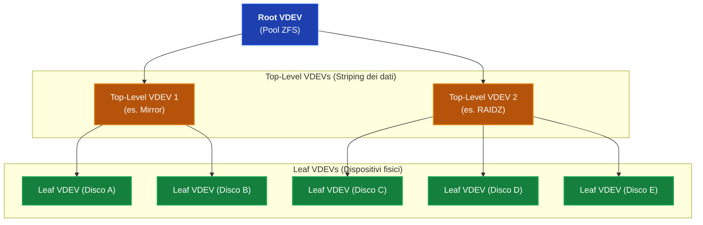

# ZFS
**fonte**: [https://openzfs.org/wiki/System_Administration](https://openzfs.github.io/openzfs-docs/Basic%20Concepts/Copy-on-write.html)
https://blog.victormendonca.com/2020/11/03/zfs-for-dummies/

Uno dei principi fondamentali di ZFS:
> Un blocco in uso non viene mai sovrascritto.

Modificare dati vuol dire dunque scrivere il nuovo contenuto in una nuova porzione di memoria, ed il filesystem dovra puntare a questa nuova area.

Questo principio, permette di implementare e gestire facilmente feature piu "avanzate" come snapshots ed il self-healing.

## pool
Una pool e' come un grande albero:
* le foglie contengono i dati
* i nodi interiori sono dei **block pointers**

**block pointer**: un block pointer tiene traccia di in quali record si trova il figlio, la grandezza e la **checksum**.
* **checksum**: un block pointer contiene la checksum dei nodi figli

**uberblock**: e' il nodo radice, tutta la pool e' navigabile a partire da qui.

modificare i dati nel filesystem vuol dire ricostruire la catena dei padri a partire dalla foglia:
* $D_{4}$ viene liberato, a meno che uno snapshot non lo contenga.]
* $D_{4}'$ e' il blocco $D_{4}$ modificato.
* La modifica a $D_{4}$ scatena il ricalcolo della checksum e il cambio dei puntatori al blocco dati in $\text{ind 2}$
* La modifica alla checksum in $\text{ind2}$ scatena il ricalcolo delle checksum di $\text{root}$
* ecc.

dopo la modifica otteniamo $\text{uberblock'}$, la nuova radice che descrive il filesystem con i dati $D_{4}'$. L'intera operazione descritta e' **atomica**.

Il costo per una modifica nella pool e' proporzionale alla profondita dell'albero, che non e' necessariamente legato alla grandezza in byte della pool. Il vecchio albero inoltre risiede ancora in memoria per poterne effettuare uno snapshot 

## transaction groups
Le transazioni sul filesystem sono raggruppate in transaction groups: **txg**. L'intero gruppo viene eseguito atomicamente.

Se un tipo di transazione accumula troppi *dirty data* oppure fa scattare un timeout (di default di 5 secondi), la transazione viene annullata ed il file system ritorna all'ultimo albero per cui e' stato fatto il commit.

> L'ultimo commit potrebbe non essere esattamente l'albero con i dati piu recenti. Tutta via analizzando il log prodotto dal file system: ZFS Intent, si possono recuperare le differenze.


## vantaggi di pool e transazioni
**Gli snapshot del filesystem vengono eseguiti a costo quasi zero**. Fare uno snapshot vuol dire, chiedere al filesystem di non liberare i dati delle foglie se questi devono essere eliminati o modificati in versioni future dell'albero.

**Clonare costa poco in memoria**: basta un riferimento allo stesso blocco.

ZFS tiene traccia per ogni blocco del **txg** che lo ha creato, dunque ZFS puo' facilemente identificare quali blocchi sono stati creati tra uno snapshot e l'altro.

ZFS e' in grado di identificare gli erorri nei blocchi grazie al controllo della corrispettiva checksum che risiede nel padre. Se nella pool esiste una copia, ridondante dei dati, allora ZFS puo' automaticamente ripristinarne il contenuto.

## quando ZFS costa in memoria?

**Frammentazione**: modificare un file vuol dire allocare qua e la nella pool nuovi blocchi. Dunque modificare un blocco in ZFS vuol dire rompere la sequenzialità dei blocchi nel file system. Ne consegue che le performance di ZFS dipendono da quanto spazio libero c'e' nella pool.

> Se la pool e' vuota allora trovare spazio contiguo e' facile, altrimenti l'allocatore deve lavorare di piu per trovare spazio per nuovi dati.

Per fare qualsiasi modifica, anche un'eliminazione, ZFS ha bisogno di memoria.

Per fare una modifica parziale ad un record, bisogna leggerlo, modificarlo e scriverlo dentro un nuovo record. Dunque piccole modifiche possono essere molto costose.

# struttura di una pool
## `vdev`
Un vedv (virtual device) e' un blocco fondamentale in ZFS. E' un raggruppamento logico di device di dati fisici (hard disk, ssd, ecc...)

una **foglia vdev** e' il un tipo di vdev che corrisponde ad uno storage fisico, ossia l'endpoint nella gerarchia dei tipi di storage in ZFS.

I `top-level vdevs`, sono i device figli del `root vdev`. Possono essere device singoli, oppure gruppi logici che raggrupano piu **foglie** `vdevs`.

La `root vdev` si trova in cima alla gerarchia della pool, ed aggrega i vdev figli in un'unica unita di storage, ossia la pool.



Ci sono diversi tipi di `vdevs`:
* **single device**: rappresenta un singolo disco, file o partizione usata a livell di top-level vdev. non dispone di meccanismi di ridondanza.
* **mirror**: e' un vdev che tiene in memoria gli stessi dati su uno o piu dispositivi per ridondanza.
* **RAIDZ**: un vdev che offre ridondanza e fault tollerance. 
* **dRAID**: un vdev che offre parita distribuita.

Ci sono altri tipi di `vdev`, tra cui:
* **Spare**: un dispositivo che rimpiazza dispositivi che falliscono.
* **Cache**:  un dispositivo utilizzato per fare il cache di dati utilizzati frequentemente nalla pool. Mantiene le copie dei dati gia presenti nella pool, dunque se un giorno esplode non e' un problema.

## quindi a che serve un vdev?
I vdev sono i blocchi fondamentali di una pool ZFS. Il modo in cui i vdev sono orchestrati determinano le performance del sistema, la capacita e la ridondanza dei dati.

# dataset
Una pool e' una pila di spazio, i dataset descrivono il modo in cui lo spazio viene suddivso. Creare un dataset e' un'operazione leggera e non comporta allocazione.

tipi di dataset:
* **file system**: un file system POSIX montato-.
* **volume**: un dispositivo a blocchi usato per macchine virtuali swap e file system non supportati da ZFS.
* **snapshot**.

i dataset formano una **gerarchia**. questa gerarchia rispecchia i nomi dei dataset e le proprieta vengono ereditate da questa gerarchia.


```bash
zfs create pool/home
zfs create pool/home/alice
zfs create -V 40G pool/vm/disk0        # a zvol

zfs list                               # file systems and volumes
zfs list -t all -r pool                # everything, recursively
zfs destroy pool/home/alice
```


# snapshots
creare uno snapshot vuol dire creare un albero che punta ai blocchi di dati che erano "**in vita**" al momento dello snapshot.

Uno snapshot e' una copia read-only del sistema o di un volume ad un determinato istante. Creare uno snapshot e' un'operazione quasi istantanea, non consuma spazio ed e' atomica anche se ricorsiva (ossia sono coinvolti piu dataset)

uno snapshot e' raggiungibile tramite la cartella `.zfs/snapshot` 

> il restore di un file da uno snapshot si fa in questo modo: `cp /home/user/.zfs/snapshot/.../notes.txt /home/user/notes.txt`


il comando `zfs rollback` permette di scartare le modifiche effettuate dall'ultimo snapshot e di tornare a quel determinato stato.

## clones
Un clone e' un dataset scrivibile, i cui contenuti iniziali sono quelli di uno snapshot. Come uno snapshot, il clone inizialmente non consuma memoria, e poi comincia a divergere rispetto all'origine con  l'aumentare delle modifiche effettuate.