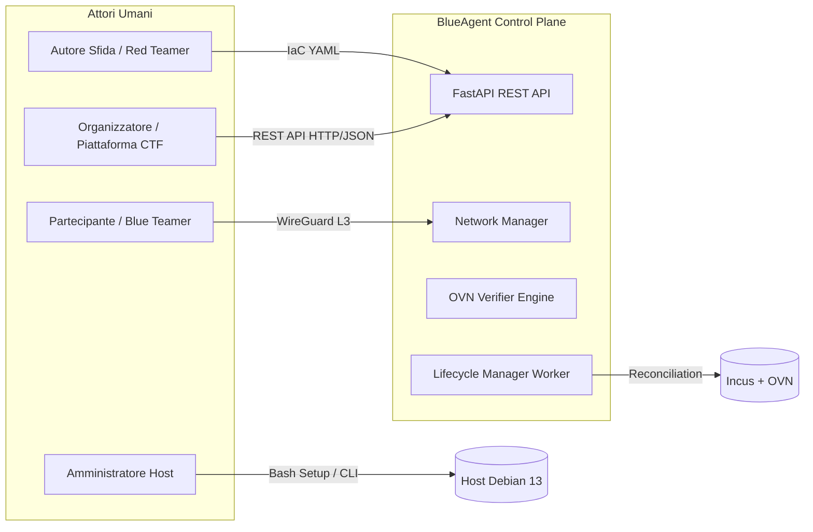
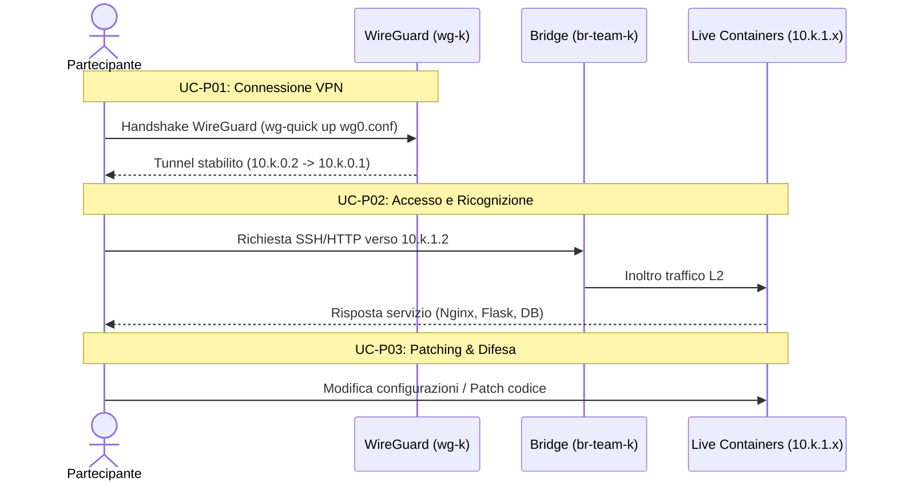
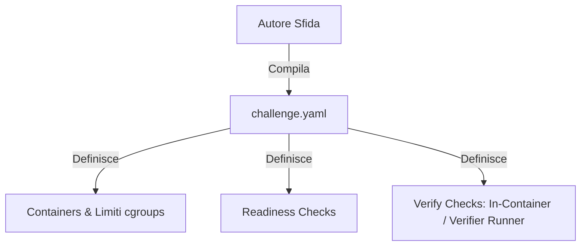
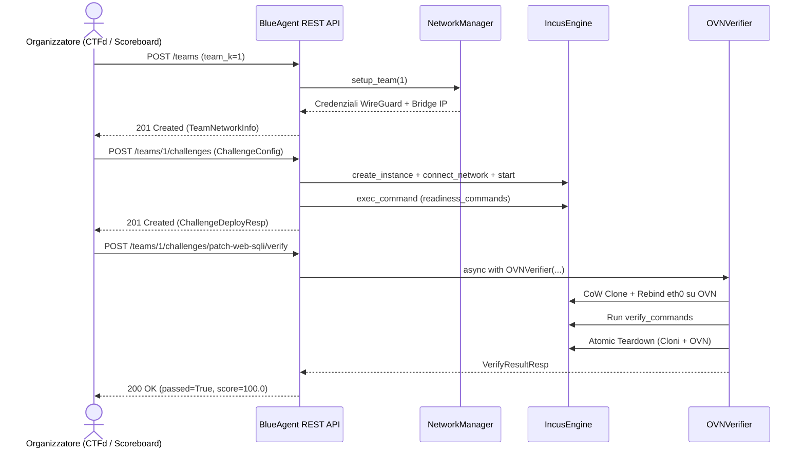
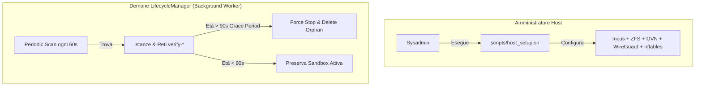

# BlueAgent v2 — Requisiti e Casi d'Uso del Sistema

> Documento di specifica dei **Requisiti Utente**, **Requisiti di Sistema**, **Matrice di Tracciabilità** e **Casi d'Uso (Use Cases)** raggruppati per attore coinvolto.

---

## Indice dei Contenuti

1. [Attori del Sistema](#1-attori-del-sistema)
2. [Requisiti Utente (User Requirements)](#2-requisiti-utente-user-requirements)
   - [UR-ACC: Accesso, Connettività & User Experience](#categoria-ur-acc-accesso-connettività--user-experience)
   - [UR-CHL: Definizione Challenge & IaC](#categoria-ur-chl-definizione-challenge--iac)
   - [UR-VER: Verifica, Valutazione & Integrità](#categoria-ur-ver-verifica-valutazione--integrità)
   - [UR-ORG: Amministrazione, Orchestrazione & API](#categoria-ur-org-amministrazione-orchestrazione--api)
3. [Requisiti di Sistema (System Requirements)](#3-requisiti-di-sistema-system-requirements)
   - [SR-HST: Host & Piattaforma di Esecuzione](#categoria-sr-hst-host--piattaforma-di-esecuzione)
   - [SR-ENG: Motore di Containerizzazione & I/O](#categoria-sr-eng-motore-di-containerizzazione--io)
   - [SR-NET: Rete Ibrida, Routing & Traffico](#categoria-sr-net-rete-ibrida-routing--traffico)
   - [SR-VRF: Motore di Verifica OVN (Dark Sandbox)](#categoria-sr-vrf-motore-di-verifica-ovn-dark-sandbox)
   - [SR-CON: Control Plane, Concorrenza & Ciclo di Vita](#categoria-sr-con-control-plane-concorrenza--ciclo-di-vita)
   - [SR-MOD: Modellazione Dati & Validazione IaC](#categoria-sr-mod-modellazione-dati--validazione-iac)
4. [Matrice di Tracciabilità (UR ↔ SR)](#4-matrice-di-tracciabilità-ur--sr)
5. [Casi d'Uso Utente Raggruppati per Attore](#5-casi-duso-utente-raggruppati-per-attore)
   - [Gruppo 1: Partecipante / Concorrente (Blue Teamer)](#gruppo-1-partecipante--concorrente-blue-teamer)
   - [Gruppo 2: Autore della Sfida (Challenge Author / Red Teamer)](#gruppo-2-autore-della-sfida-challenge-author--red-teamer)
   - [Gruppo 3: Organizzatore di Gara / Piattaforma CTF (Platform Admin / Scoreboard)](#gruppo-3-organizzatore-di-gara--piattaforma-ctf-platform-admin--scoreboard)
   - [Gruppo 4: Amministratore di Sistema / Demoni Automatici (System Admin / Background Daemons)](#gruppo-4-amministratore-di-sistema--demoni-automatici-system-admin--background-daemons)

---

## 1. Attori del Sistema

Il sistema identifica quattro ruoli principali:

1. **Partecipante / Concorrente (Blue Teamer)**: utente che accede in sola VPN alla propria infrastruttura assegnata per analizzare i servizi, difenderli e applicare patch correttive.
2. **Autore della Sfida (Challenge Author / Red Teamer)**: sviluppatore che crea la configurazione IaC (Infrastructure-as-Code) della sfida, definisce i container vulnerabili, i test di integrità e gli exploit di verifica.
3. **Organizzatore di Gara / Piattaforma CTF (Platform Admin / Scoreboard)**: sistema o amministratore che orchestra il provisioning dei team, distribuisce le sfide e ordina la verifica automatica periodica tramite REST API.
4. **Amministratore di Sistema / Demoni Automatici (System Admin / Background Tasks)**: si occupa del bootstrap iniziale dell'host bare-metal, del monitoraggio di salute dell'orchestratore e della bonifica automatica (self-healing) di eventuali risorse rimaste orfane.

---

## 2. Requisiti Utente (User Requirements)

Convenzione identificativa: **`UR-<CATEGORIA>-<ID>`**

### Categoria UR-ACC: Accesso, Connettività & User Experience

| Codice | Titolo Requisito | Descrizione Operativa | Ruolo Beneficiario |
| :--- | :--- | :--- | :--- |
| **UR-ACC-01** | Connessione VPN dedicata e sicura | Il partecipante deve poter accedere in modo esclusivo e cifrato al proprio ambiente di gara tramite un tunnel WireGuard dedicato, isolato dal traffico degli altri concorrenti. | Partecipante |
| **UR-ACC-02** | Topologia di rete uniforme e deterministica | Ogni squadra deve disporre della medesima topologia interna (`10.k.1.0/24`) e degli stessi indirizzi IP statici (es. Server Web su `.2`, Database su `.3`), senza disparità tra team. | Partecipante |
| **UR-ACC-03** | Prestazioni I/O e latenza near-bare-metal | Il concorrente deve interagire con i container a velocità nativa di bus RAM e bridge kernel L2, senza il degrado di throughput tipico delle reti virtuali SDN durante la fase di live game. | Partecipante |

### Categoria UR-CHL: Definizione Challenge & IaC

| Codice | Titolo Requisito | Descrizione Operativa | Ruolo Beneficiario |
| :--- | :--- | :--- | :--- |
| **UR-CHL-01** | Definizione dichiarativa via YAML (IaC) | L'autore deve poter descrivere l'intera architettura della sfida (servizi, immagini, porte, controlli) tramite un file YAML standard e leggibile. | Autore Sfida |
| **UR-CHL-02** | Ambienti multi-container e stateful | La piattaforma deve consentire l'esecuzione di scenari complessi composti da più container con sistema operativo completo (systemd, demoni, persistenza dello stato). | Autore Sfida |
| **UR-CHL-03** | Quote e vincoli di risorse (Cgroups) | L'autore deve poter definire limiti perentori di CPU e RAM per container per evitare attacchi DoS o saturazione delle risorse del server. | Autore Sfida |
| **UR-CHL-04** | Controlli di prontezza (Readiness Checks) | L'autore deve poter dichiarare verifiche iniziali eseguite all'avvio (es. socket listening, ping database) prima che la sfida venga aperta ai concorrenti. | Autore Sfida |

### Categoria UR-VER: Verifica, Valutazione & Integrità

| Codice | Titolo Requisito | Descrizione Operativa | Ruolo Beneficiario |
| :--- | :--- | :--- | :--- |
| **UR-VER-01** | Verifica non distruttiva (Zero Live Crash) | L'esecuzione dei test di exploit o controlli di patch da parte della piattaforma non deve alterare lo stato né mandare in crash l'ambiente di produzione vivo del team. | Partecipante / Organizzatore |
| **UR-VER-02** | Protezione da Side-Channel Leaks | I payload di exploit, gli script di validazione e le flag non devono essere intercettabili dai partecipanti (es. tramite `tcpdump` o log di sistema sul bridge di gara). | Organizzatore / Autore |
| **UR-VER-03** | Dual-Mode Verification (Audit & Black-Box) | L'autore deve poter scegliere se eseguire comandi direttamente dentro il container replicato oppure iniettare exploit di rete da un container attaccante effimero posto sulla medesima rete logica. | Autore Sfida |
| **UR-VER-04** | Risposta di verifica rapida | L'esito della verifica deve essere calcolato e ritornato in pochi secondi, con clonazione dell'ambiente istantanea (~100 ms). | Partecipante / Organizzatore |

### Categoria UR-ORG: Amministrazione, Orchestrazione & API

| Codice | Titolo Requisito | Descrizione Operativa | Ruolo Beneficiario |
| :--- | :--- | :--- | :--- |
| **UR-ORG-01** | Control Plane REST API programmabile | Tutte le funzionalità di ciclo di vita (creazione team, avvio sfide, verifica e teardown) devono essere richiamabili via API HTTP con payload JSON da scoreboard esterni (es. CTFd). | Organizzatore |
| **UR-ORG-02** | Osservabilità e monitoraggio trasparente | Gli organizzatori devono poter monitorare e sniffare il traffico live dei team con i consueti strumenti di analisi Linux (`tcpdump -i br-team-k`). | Organizzatore |
| **UR-ORG-03** | Bonifica e pulizia automatica | La piattaforma deve assicurare la rimozione automatica delle sandbox e la terminazione delle risorse orfane in caso di fallimenti improvvisi o timeout. | Organizzatore / Admin |

---

## 3. Requisiti di Sistema (System Requirements)

Convenzione identificativa: **`SR-<CATEGORIA>-<ID>`**

### Categoria SR-HST: Host & Piattaforma di Esecuzione

| Codice | Componente | Descrizione Tecnica | Riferimento Codice |
| :--- | :--- | :--- | :--- |
| **SR-HST-01** | OS & Moduli Kernel | Supporto target Debian 13 (Trixie) con kernel Linux moderno comprendente moduli WireGuard, cgroups v2 e supporto `nftables` con IP Forwarding abilitato (`net.ipv4.ip_forward=1`). | [host_setup.sh](file:///home/debian/blueagent/scripts/host_setup.sh#L43-L49) |
| **SR-HST-02** | Storage Pool CoW | Configurazione di uno storage pool Incus su ZFS (o Btrfs) denominato `blueagent-zfs`, capace di clonare container istantaneamente a livello di blocchi. | [config.py](file:///home/debian/blueagent/src/blueagent/config.py#L11), [specification.md](file:///home/debian/blueagent/agent/specification.md#L26) |
| **SR-HST-03** | Demoni SDN Host | Presenza attiva di Open vSwitch e OVN (`ovs-vswitchd`, `ovsdb-server`, `ovn-northd`, `ovn-controller`) con listener TCP su `tcp:127.0.0.1:6641` per Incus. | [host_setup.sh](file:///home/debian/blueagent/scripts/host_setup.sh#L57-L69) |
| **SR-HST-04** | Uplink Parent Bridge | Il bridge di sistema `incusbr0` deve dichiarare sia un pool DHCP (`ipv4.dhcp.ranges=172.16.0.2-172.16.0.99`) sia un intervallo di subnet allocabili OVN (`ipv4.ovn.ranges=172.16.0.100-172.16.0.199`) per connettere a monte le reti logiche effimere. | [setup.sh](file:///home/debian/blueagent/scripts/setup.sh#L36-L40) |

### Categoria SR-ENG: Motore di Containerizzazione & I/O

| Codice | Componente | Descrizione Tecnica | Riferimento Codice |
| :--- | :--- | :--- | :--- |
| **SR-ENG-01** | Interfaccia Astratta Engine | Implementazione dell'interfaccia astratta [ContainerEngine](file:///home/debian/blueagent/src/blueagent/engine/base.py#L17) per disaccoppiare la logica applicativa dal runtime sottostante (Incus/Docker). | [base.py](file:///home/debian/blueagent/src/blueagent/engine/base.py#L17-L85) |
| **SR-ENG-02** | Client Asincrono UDS | [IncusEngine](file:///home/debian/blueagent/src/blueagent/engine/incus.py#L17) deve comunicare via Unix Domain Socket (`/var/lib/incus/unix.socket`) mediante `httpx.AsyncClient` con risoluzione corretta dei path relativi. | [incus.py](file:///home/debian/blueagent/src/blueagent/engine/incus.py#L20-L44) |
| **SR-ENG-03** | Sincronizzazione Long-Polling | La sincronizzazione delle operazioni Incus asincrone deve avvenire invocando `/operations/{uuid}/wait?timeout=N`, rilevando stati di `Success`, `Failure` o `Cancelled`. | [incus.py](file:///home/debian/blueagent/src/blueagent/engine/incus.py#L46-L73) |
| **SR-ENG-04** | Clonazione Snapshot CoW | Implementazione del metodo `clone_instance` basato su copia a livello di snapshot (`instance_only: true`), con tempi medi di duplicazione $\le 100\text{ ms}$. | [incus.py](file:///home/debian/blueagent/src/blueagent/engine/incus.py#L117-L135) |
| **SR-ENG-05** | Isolamento Cgroups v2 | Applicazione delle quote hardware `limits.cpu` e `limits.memory` sulle istanze Incus per garantire confini prestazionali deterministici. | [incus.py](file:///home/debian/blueagent/src/blueagent/engine/incus.py#L82-L86) |

### Categoria SR-NET: Rete Ibrida, Routing & Traffico

| Codice | Componente | Descrizione Tecnica | Riferimento Codice |
| :--- | :--- | :--- | :--- |
| **SR-NET-01** | Tunnel WireGuard L3 | Per ciascun team $k$, creazione dell'interfaccia `wg-k` su subnet `10.k.0.1/24` con Cryptokey Routing associato alla chiave pubblica di ciascun membro (`AllowedIPs = 10.k.0.x/32`). | [wireguard.py](file:///home/debian/blueagent/src/blueagent/network/wireguard.py) |
| **SR-NET-02** | Linux Bridge L2 Live | Per ciascun team $k$, allocazione di un bridge kernel `br-team-k` con IP `10.k.1.1/24`, associato a un profilo Incus `team-k-profile` per l'aggancio diretto delle `veth`. L'IP statico deterministico (`10.k.1.x`) viene applicato internamente tramite `systemd-networkd` (`10-eth0.network`), preservando l'indirizzo durante le clonazioni CoW. | [host_net.py](file:///home/debian/blueagent/src/blueagent/network/host_net.py) |
| **SR-NET-03** | Overlay OVN Dark Sandbox | Per ogni verifica, creazione di una rete SDN OVN effimera (`verify-{session_id}`) su tunnel Geneve con isolamento totale dal traffico di produzione. | [ovn.py](file:///home/debian/blueagent/src/blueagent/verifier/ovn.py#L37-L50) |
| **SR-NET-04** | Fedeltà Topologica & IP Overlap | Coesistenza simultanea della medesima subnet (`10.k.1.0/24`) e della singola scheda `eth0` sia in live che in sandbox, senza conflitti di routing sull'host. | [specification.md](file:///home/debian/blueagent/agent/specification.md#L186-L198) |
| **SR-NET-05** | TCP MSS Clamping | Applicazione della regola nftables `tcp flags syn / syn,rst tcp option maxseg size set rt mtu` nella tabella `inet blueagent` per azzerare il fenomeno dell'MTU Blackhole. | [host_net.py](file:///home/debian/blueagent/src/blueagent/network/host_net.py) |
| **SR-NET-06** | NAT Masquerade | Configurazione del mascheramento postrouting nftables per la rete `10.0.0.0/8` verso l'uscita WAN dell'host. | [host_net.py](file:///home/debian/blueagent/src/blueagent/network/host_net.py) |

### Categoria SR-VRF: Motore di Verifica OVN (Dark Sandbox)

| Codice | Componente | Descrizione Tecnica | Riferimento Codice |
| :--- | :--- | :--- | :--- |
| **SR-VRF-01** | Async Context Manager | Incapsulamento del ciclo di verifica nella classe [OVNVerifier](file:///home/debian/blueagent/src/blueagent/verifier/ovn.py#L12) con gestione asincrona atomica (`__aenter__` / `__aexit__`). | [ovn.py](file:///home/debian/blueagent/src/blueagent/verifier/ovn.py#L36-L135) |
| **SR-VRF-02** | Re-binding Dinamico `eth0` | Modifica a caldo della configurazione del dispositivo di rete per i cloni, passando da bridge `br-team-k` a switch OVN `verify-{session_id}`. | [ovn.py](file:///home/debian/blueagent/src/blueagent/verifier/ovn.py#L60-L68) |
| **SR-VRF-03** | Verifier Container Effimero | Avvio opzionale di un container verifier collegato allo switch OVN per condurre test di penetrazione e richieste HTTP/exploit dall'esterno del target. | [ovn.py](file:///home/debian/blueagent/src/blueagent/verifier/ovn.py#L74-L88) |
| **SR-VRF-04** | Teardown Atomico Inverso | Chiusura garantita in ordine inverso di dipendenza: 1) stop/delete Verifier Container $\rightarrow$ 2) stop/delete Cloni Target $\rightarrow$ 3) rimozione Rete OVN. | [ovn.py](file:///home/debian/blueagent/src/blueagent/verifier/ovn.py#L117-L135) |
| **SR-VRF-05** | Esecuzione Comandi e Raccolta Log | Esecuzione sicura via `exec_command` con timeout vincolato e salvataggio puntuale di stdout, stderr e exit code. | [incus.py](file:///home/debian/blueagent/src/blueagent/engine/incus.py#L161-L230) |

### Categoria SR-CON: Control Plane, Concorrenza & Ciclo di Vita

| Codice | Componente | Descrizione Tecnica | Riferimento Codice |
| :--- | :--- | :--- | :--- |
| **SR-CON-01** | REST API FastAPI | Esposizione di endpoint asincroni ad alta efficienza per la gestione di team, sfide, verifiche e diagnostica. | [main.py](file:///home/debian/blueagent/src/blueagent/main.py#L14-L44) |
| **SR-CON-02** | Lock Registry Multi-Worker | Gestione della concorrenza tramite [LockRegistry](file:///home/debian/blueagent/src/blueagent/locks.py#L14) (`asyncio.Lock` e file locks `fcntl`) per scongiurare errori `HTTP 409 Conflict` su mutazioni parallele del medesimo team. | [locks.py](file:///home/debian/blueagent/src/blueagent/locks.py#L14-L63) |
| **SR-CON-03** | Self-Healing & Grace Period | Background worker [LifecycleManager](file:///home/debian/blueagent/src/blueagent/lifecycle/manager.py#L14) per la pulizia di sandbox orfane con grace period di sicurezza (default 90 secondi) per evitare race condition durante il provisioning. | [manager.py](file:///home/debian/blueagent/src/blueagent/lifecycle/manager.py#L42-L78) |
| **SR-CON-04** | Healthcheck & Status Probe | Endpoint `GET /health` per interrogare la reattività del socket Incus e lo stato del loop di riconciliazione. | [main.py](file:///home/debian/blueagent/src/blueagent/main.py#L46-L65) |

### Categoria SR-MOD: Modellazione Dati & Validazione IaC

| Codice | Componente | Descrizione Tecnica | Riferimento Codice |
| :--- | :--- | :--- | :--- |
| **SR-MOD-01** | Schemi Pydantic v2 | Validazione stretta dei tipi in ingresso e in uscita ([CommandSpec](file:///home/debian/blueagent/src/blueagent/models.py#L11), [ContainerSpec](file:///home/debian/blueagent/src/blueagent/models.py#L20), [VerifierSpec](file:///home/debian/blueagent/src/blueagent/models.py#L42), [ChallengeConfig](file:///home/debian/blueagent/src/blueagent/models.py#L50)). | [models.py](file:///home/debian/blueagent/src/blueagent/models.py) |
| **SR-MOD-02** | Loader YAML Flessibile | Metodo `ChallengeConfig.from_yaml` con supporto al caricamento da percorsi file, stream I/O e stringhe dirette. | [models.py](file:///home/debian/blueagent/src/blueagent/models.py#L65-L75) |
| **SR-MOD-03** | Formato Risposta Standardizzato | Risposta di verifica [VerifyResultResp](file:///home/debian/blueagent/src/blueagent/models.py#L77) indicante `success`, `passed`, `score`, tempi ed elenco dei check eseguiti. | [models.py](file:///home/debian/blueagent/src/blueagent/models.py#L77-L86) |

---

## 4. Matrice di Tracciabilità (UR ↔ SR)

| Requisito Utente (UR) | Requisiti di Sistema Corrispondenti (SR) | Meccanismo Architetturale di Risoluzione |
| :--- | :--- | :--- |
| **UR-ACC-01** (VPN Dedicata) | **SR-NET-01**, **SR-HST-01** | Generazione interfaccia `wg-k` e vincolo Cryptokey Routing `10.k.0.2/32`. |
| **UR-ACC-02** (Topologia Uniforme) | **SR-NET-02**, **SR-NET-04**, **SR-MOD-01** | Bridge `br-team-k` e suffissi statici deterministici su `10.k.1.x`. |
| **UR-ACC-03** (Prestazioni Native) | **SR-NET-02**, **SR-NET-05** | Traffico live su bridge kernel L2 esente da overhead OVS; clamping TCP MSS. |
| **UR-CHL-01** (Configurazione IaC) | **SR-MOD-01**, **SR-MOD-02** | Parsing dichiarativo YAML tramite modelli Pydantic v2. |
| **UR-CHL-02** (Multi-Container Stateful) | **SR-ENG-01**, **SR-ENG-02**, **SR-HST-02** | System container Incus con storage persistente CoW ZFS. |
| **UR-CHL-03** (Quote Risorse) | **SR-ENG-05**, **SR-MOD-01** | Applicazione quote cgroups v2 per CPU e memoria RAM. |
| **UR-CHL-04** (Readiness Checks) | **SR-CON-01**, **SR-ENG-05** | Esecuzione verifiche di boot durante il deploy (`POST /challenges`). |
| **UR-VER-01** (Zero Live Crash) | **SR-ENG-04**, **SR-VRF-01**, **SR-VRF-02** | Clonazione CoW istantanea e test condotti esclusivamente sui cloni. |
| **UR-VER-02** (No Side-Channel Leaks) | **SR-NET-03**, **SR-VRF-01** | Dark Sandbox su switch OVN Geneve, separata dal bridge live `br-team-k`. |
| **UR-VER-03** (Dual-Mode Verification) | **SR-VRF-03**, **SR-VRF-05**, **SR-MOD-01** | Supporto congiunto per `exec_command` e container runner effimero. |
| **UR-VER-04** (Verifica Rapida) | **SR-ENG-04**, **SR-ENG-03**, **SR-MOD-03** | Snapshot CoW in ~100 ms e long-polling nativo Incus non bloccante. |
| **UR-ORG-01** (Control Plane REST) | **SR-CON-01**, **SR-MOD-01** | Router FastAPI asincroni (`/teams`, `/challenges`, `/verify`). |
| **UR-ORG-02** (Monitoraggio Live) | **SR-NET-02** | Sniffing non invasivo del bridge di gara (`tcpdump -i br-team-k`). |
| **UR-ORG-03** (Bonifica Risorse) | **SR-VRF-04**, **SR-CON-03** | Teardown atomico via Context Manager e task [LifecycleManager](file:///home/debian/blueagent/src/blueagent/lifecycle/manager.py#L14). |

---

## 5. Casi d'Uso Utente Raggruppati per Attore

### Gruppo 1: Partecipante / Concorrente (Blue Teamer)

#### `UC-P01`: Connessione sicura all'infrastruttura di gara (WireGuard)
* **Attore Primario**: Partecipante (Blue Teamer).
* **Obiettivo**: Stabilire una connessione L3 cifrata e diretta verso l'infrastruttura del team.
* **Precondizioni**: Il partecipante ha ottenuto il file `wg0.conf` dalla piattaforma di gara.
* **Flusso Principale**:
  1. Il partecipante avvia WireGuard sul proprio terminale (`wg-quick up wg0.conf`).
  2. Viene effettuato l'handshake con l'endpoint host (`wg-k`, `10.k.0.1`).
  3. Il kernel host convalida la chiave pubblica tramite Cryptokey Routing vincolando l'IP `10.k.0.2`.
* **Postcondizioni**: La rotta per `10.k.0.0/16` è attiva e il gateway `10.k.1.1` è raggiungibile a bassa latenza.
* **Requisiti Correlati**: `UR-ACC-01`, `SR-NET-01`.

#### `UC-P02`: Accesso e ricognizione dei servizi applicativi live
* **Attore Primario**: Partecipante (Blue Teamer).
* **Obiettivo**: Raggiungere i singoli container della sfida per esaminare porte, servizi e configurazioni.
* **Precondizioni**: Tunnel WireGuard attivo; sfida distribuita e pronta.
* **Flusso Principale**:
  1. Il partecipante esegue comandi di ricognizione (es. `curl http://10.k.1.2:8080`, `ssh root@10.k.1.2`).
  2. I pacchetti attraversano `wg-k` e transitano sul bridge non gestito `br-team-k`.
  3. Il container target riceve i frame sull'interfaccia `eth0` rispondendo direttamente al partecipante.
* **Postcondizioni**: Il partecipante ha visibilità dei servizi esposti.
* **Requisiti Correlati**: `UR-ACC-02`, `UR-ACC-03`, `SR-NET-02`.

#### `UC-P03`: Applicazione di patch e contromisure difensive
* **Attore Primario**: Partecipante (Blue Teamer).
* **Obiettivo**: Correggere la vulnerabilità segnalata (es. mitigazione SQL Injection, filtro input, hardening).
* **Precondizioni**: Accesso al container di interesse (`10.k.1.x`).
* **Flusso Principale**:
  1. Il partecipante modifica i file di codice sorgente o le configurazioni applicative del container.
  2. Riavvia o ricarica il servizio applicativo (es. `systemctl restart webapp`).
  3. Verifica in autonomia la funzionalità locale del servizio.
* **Postcondizioni**: Lo stato del container live riflette le modifiche e le patch difensive.
* **Requisiti Correlati**: `UR-CHL-02`, `UR-VER-01`, `SR-ENG-04`.

#### `UC-P04`: Consultazione dell'esito della verifica
* **Attore Primario**: Partecipante (Blue Teamer).
* **Obiettivo**: Ricevere il responso della verifica automatizzata (superata o fallita, punti assegnati, dettagli).
* **Precondizioni**: Richiesta di verifica scatenata da scoreboard o dal concorrente.
* **Flusso Principale**:
  1. Il partecipante visualizza sulla dashboard di gara l'esito del check.
  2. In caso di fallimento, legge il messaggio di errore (es. servizio non rispondente o exploit ancora funzionante).
  3. In caso di successo, riceve conferma della corretta difesa del servizio.
* **Postcondizioni**: Il partecipante adegua la propria strategia in base all'esito.
* **Requisiti Correlati**: `UR-VER-04`, `SR-MOD-03`.

---

### Gruppo 2: Autore della Sfida (Challenge Author / Red Teamer)

#### `UC-A01`: Progettazione dichiarativa della sfida (IaC)
* **Attore Primario**: Autore della Sfida.
* **Obiettivo**: Formalizzare la sfida multi-servizio in un descrittore riutilizzabile e versionabile.
* **Precondizioni**: Immagini di base preparate (tramite Distrobuilder o Incus aliases).
* **Flusso Principale**:
  1. L'autore crea il file YAML (es. [patch-web-sqli.yaml](file:///home/debian/blueagent/challenges/patch-web-sqli.yaml)).
  2. Specifica `challenge_id`, titolo, descrizione e flag di accesso a internet.
  3. Elenca i container con i loro suffissi IP (`ip_suffix: 2`, `ip_suffix: 3`).
* **Postcondizioni**: Struttura della sfida validabile tramite lo schema [ChallengeConfig](file:///home/debian/blueagent/src/blueagent/models.py#L50).
* **Requisiti Correlati**: `UR-CHL-01`, `UR-CHL-02`, `SR-MOD-01`, `SR-MOD-02`.

#### `UC-A02`: Allocazione delle quote di risorse (Cgroups Limits)
* **Attore Primario**: Autore della Sfida.
* **Obiettivo**: Assegnare limiti massimi di CPU e memoria a ciascun container.
* **Precondizioni**: File YAML in fase di stesura.
* **Flusso Principale**:
  1. L'autore imposta i campi `limits_cpu` (es. `"1"`) e `limits_memory` (es. `"256MB"`, `"512MB"`).
  2. Il sistema convaliderà tali stringhe e le mapperà direttamente nella configurazione Incus (`limits.cpu`, `limits.memory`).
* **Postcondizioni**: Container dimensionati per evitare che saturino l'hardware dell'host.
* **Requisiti Correlati**: `UR-CHL-03`, `SR-ENG-05`.

#### `UC-A03`: Definizione dei controlli di readiness (Health Checks)
* **Attore Primario**: Autore della Sfida.
* **Obiettivo**: Stabilire le condizioni di avvio e stabilità prima che il team possa interagire.
* **Precondizioni**: Container della sfida definiti.
* **Flusso Principale**:
  1. L'autore definisce la lista `readiness_commands` nel file YAML.
  2. Specifica il container target, il comando da eseguire (`cmd`) e il timeout massimo.
  3. Esempi: ping su porta MySQL (`mysqladmin ping`), chiamata HTTP di health (`curl -s http://127.0.0.1:8080/health`).
* **Postcondizioni**: Il deployment verificherà che tutti i comandi di readiness ritornino `exit_code: 0`.
* **Requisiti Correlati**: `UR-CHL-04`, `SR-CON-01`.

#### `UC-A04`: Configurazione della verifica in modalità In-Container
* **Attore Primario**: Autore della Sfida.
* **Obiettivo**: Verificare l'integrità di file, configurazioni o patch locali senza richiedere traffico di rete esterno.
* **Precondizioni**: Specifica della sfida aperta.
* **Flusso Principale**:
  1. L'autore aggiunge una voce in `verify_commands` con `target: "container"`.
  2. Indica il nome del container target (es. `"server"`) e il comando di audit (es. grep su file di config, check permessi).
* **Postcondizioni**: Il verifier eseguirà il check direttamente nel container replicato tramite `exec_command`.
* **Requisiti Correlati**: `UR-VER-03`, `SR-VRF-05`.

#### `UC-A05`: Configurazione della verifica in modalità Black-Box (Verifier Runner)
* **Attore Primario**: Autore della Sfida.
* **Obiettivo**: Testare la presenza di vulnerabilità di rete o exploit remoti replicando il punto di vista di un attaccante esterno.
* **Precondizioni**: Specifica della sfida aperta.
* **Flusso Principale**:
  1. L'autore imposta la sezione `verifier` in YAML (es. immagine `curlimages/curl:latest` o Python con script di exploit).
  2. Aggiunge le voci in `verify_commands` con `target: "verifier"`.
  3. Configura le variabili d'ambiente necessarie (es. `FLAG_KEY`, token segreti).
* **Postcondizioni**: Il verifier istanzierà un runner effimero dedicato sulla stessa rete OVN per lanciare l'attacco.
* **Requisiti Correlati**: `UR-VER-02`, `UR-VER-03`, `SR-VRF-03`.

---

### Gruppo 3: Organizzatore di Gara / Piattaforma CTF (Platform Admin / Scoreboard)

#### `UC-O01`: Provisioning ambiente e VPN per un team
* **Attore Primario**: Organizzatore / Piattaforma CTF.
* **Obiettivo**: Creare l'intera infrastruttura di isolamento per la squadra $k$.
* **Precondizioni**: Il team non è ancora allocato sulla piattaforma.
* **Flusso Principale**:
  1. La piattaforma invia `POST /teams` indicando `team_k` (es. `1`).
  2. BlueAgent acquisisce il lock per `team-1`.
  3. Crea il bridge `br-team-1` (`10.1.1.1/24`), l'interfaccia `wg-1` e il profilo Incus.
  4. Genera la configurazione client `wg0.conf`.
* **Postcondizioni**: Risposta HTTP 201 contenente il file WireGuard e i parametri di rete.
* **Requisiti Correlati**: `UR-ORG-01`, `UR-ACC-01`, `SR-NET-01`, `SR-NET-02`, `SR-CON-01`.

#### `UC-O02`: Ispezione dello stato del team
* **Attore Primario**: Organizzatore / Piattaforma CTF.
* **Obiettivo**: Verificare lo stato operativo e la connettività delle interfacce del team.
* **Precondizioni**: Team precedentemente allocato.
* **Flusso Principale**:
  1. Esegue `GET /teams/{team_id}`.
  2. Il sistema interroga lo stato del bridge di rete, il peer WireGuard associato e il profilo Incus.
* **Postcondizioni**: Risposta JSON con lo stato di link up/down e configurazioni correnti.
* **Requisiti Correlati**: `UR-ORG-01`, `SR-CON-01`.

#### `UC-O03`: Distribuzione e attivazione di una sfida
* **Attore Primario**: Organizzatore / Piattaforma CTF.
* **Obiettivo**: Istanziare i container del challenge e renderli operativi per il team.
* **Precondizioni**: Team allocato; payload [ChallengeConfig](file:///home/debian/blueagent/src/blueagent/models.py#L50) disponibile.
* **Flusso Principale**:
  1. Invia `POST /teams/{team_id}/challenges` con la specifica della sfida.
  2. Crea i container su Incus con le quote CPU/RAM specificate.
  3. Connette la scheda `eth0` al bridge `br-team-{id}` assegnando l'IP statico `10.{id}.1.{suffix}`.
  4. Avvia i container ed esegue i controlli di readiness.
  5. Registra la configurazione nel registro attivo del team.
* **Postcondizioni**: Risposta HTTP 201 [ChallengeDeployResp](file:///home/debian/blueagent/src/blueagent/api/challenges.py#L19) con lista istanze attive e stato `"ready"`.
* **Requisiti Correlati**: `UR-ORG-01`, `UR-CHL-02`, `SR-ENG-01`, `SR-ENG-05`, `SR-CON-01`.

#### `UC-O04`: Elenco delle sfide attive per un team
* **Attore Primario**: Organizzatore / Piattaforma CTF.
* **Obiettivo**: Ottenere la lista di tutti i challenge correntemente distribuiti e attivi per una squadra.
* **Precondizioni**: Richiesta inviata per un `team_id` valido.
* **Flusso Principale**:
  1. Invia `GET /teams/{team_id}/challenges`.
  2. Riceve l'elenco dei challenge con ID, titolo e nomi dei container attivi.
* **Postcondizioni**: Payload JSON con i challenge in esecuzione.
* **Requisiti Correlati**: `UR-ORG-01`, `SR-CON-01`.

#### `UC-O05`: Esecuzione verifica automatizzata su OVN Sandbox
* **Attore Primario**: Organizzatore / Piattaforma CTF.
* **Obiettivo**: Validare le patch e assegnare il punteggio senza interrompere o corrompere l'ambiente live.
* **Precondizioni**: Challenge attivo per il team specificato.
* **Flusso Principale**:
  1. Invia `POST /teams/{team_id}/challenges/{challenge_id}/verify`.
  2. BlueAgent acquisisce il lock esclusivo del team per serializzare l'operazione.
  3. Crea istantaneamente una rete logica OVN effimera (`verify-{uuid}`) collegata a `incusbr0`.
  4. Esegue uno snapshot CoW ZFS dei container live (~100 ms) e re-instrada `eth0` su OVN mantenendo i medesimi IP (`10.k.1.x`).
  5. Se richiesto, avvia il verifier runner container effimero collegato allo switch OVN.
  6. Esegue sequenzialmente i `verify_commands` catturando stdout, stderr e exit code.
  7. Al termine (anche in caso di errore), distrugge le repliche e cancella la rete OVN.
* **Postcondizioni**: Risposta [VerifyResultResp](file:///home/debian/blueagent/src/blueagent/models.py#L77) con `success=True`, `passed=True/False`, punteggio, tempi e log dettagliati.
* **Requisiti Correlati**: `UR-VER-01`, `UR-VER-02`, `UR-VER-03`, `UR-VER-04`, `SR-VRF-01`, `SR-VRF-02`, `SR-VRF-03`, `SR-VRF-04`.

#### `UC-O06`: Ispezione e monitoraggio del traffico live
* **Attore Primario**: Organizzatore / Amministratore di Gara.
* **Obiettivo**: Rilevare anomalie, registrare il traffico di gara (PCAP) o verificare tentativi di attacco in tempo reale.
* **Precondizioni**: Bridge del team `br-team-k` attivo sull'host.
* **Flusso Principale**:
  1. L'organizzatore accede via shell all'host Linux.
  2. Esegue `tcpdump -nn -i br-team-k` specificando filtri di porta o indirizzo IP.
  3. Analizza i flussi tra il partecipante e i container vivi a velocità di bus nativa.
* **Postcondizioni**: Cattura effettuata in modo trasparente senza impatto prestazionale per il team.
* **Requisiti Correlati**: `UR-ORG-02`, `UR-ACC-03`, `SR-NET-02`.

#### `UC-O07`: Dismissione di una sfida per un team
* **Attore Primario**: Organizzatore / Piattaforma CTF.
* **Obiettivo**: Terminare una sfida specifica liberando CPU e RAM pur mantenendo la VPN e il bridge del team.
* **Precondizioni**: Challenge presente nel registro del team.
* **Flusso Principale**:
  1. Invia `DELETE /teams/{team_id}/challenges/{challenge_id}`.
  2. Incus arresta forzatamente ed elimina tutti i container associati alla sfida.
  3. La sfida viene rimossa dal registro.
* **Postcondizioni**: Istanze eliminate e risorse hardware rilasciate.
* **Requisiti Correlati**: `UR-ORG-01`, `SR-ENG-01`, `SR-CON-01`.

#### `UC-O08`: De-provisioning e rilascio totale del team
* **Attore Primario**: Organizzatore / Piattaforma CTF.
* **Obiettivo**: Smantellare completamente l'ambiente di gara di una squadra al termine dell'evento.
* **Precondizioni**: Eventuali container del team arrestati o pronti per la rimozione.
* **Flusso Principale**:
  1. Invia `DELETE /teams/{team_id}`.
  2. Vengono distrutte l'interfaccia `wg-k` e il bridge `br-team-k`.
  3. Viene eliminato il profilo Incus `team-k-profile`.
  4. Vengono rimosse le rotte di routing e i vincoli associati al team.
* **Postcondizioni**: Nodo host ripulito da tutte le interfacce e profili appartenenti al team $k$.
* **Requisiti Correlati**: `UR-ORG-01`, `UR-ORG-03`, `SR-NET-01`, `SR-NET-02`, `SR-CON-01`.

---

### Gruppo 4: Amministratore di Sistema / Demoni Automatici (System Admin / Background Daemons)

#### `UC-S01`: Bootstrap e inizializzazione del nodo host
* **Attore Primario**: Amministratore di Sistema.
* **Obiettivo**: Predisporre l'host Debian 13 per l'orchestrazione ibrida (Linux + OVN).
* **Precondizioni**: Sistema operativo Debian 13 installato pulito con privilegi `sudo`.
* **Flusso Principale**:
  1. L'amministratore lancia [scripts/host_setup.sh](file:///home/debian/blueagent/scripts/host_setup.sh).
  2. Lo script installa `incus`, `openvswitch-switch`, `ovn-central`, `ovn-host`, `zfsutils-linux`, `wireguard`, `nftables`.
  3. Abilita l'IP forwarding permanente in `/etc/sysctl.d/99-blueagent.conf`.
  4. Inizializza Incus con pool storage ZFS `blueagent-zfs`.
  5. Espone il database OVN Northbound localmente (`ptcp:6641:127.0.0.1`) e lo registra in Incus.
  6. Configura il range OVN sul bridge `incusbr0`.
* **Postcondizioni**: Host pienamente pronto all'avvio del server FastAPI.
* **Requisiti Correlati**: `SR-HST-01`, `SR-HST-02`, `SR-HST-03`, `SR-HST-04`.

#### `UC-S02`: Bonifica automatica delle sandbox orfane (Self-Healing)
* **Attore Primario**: Demone di Background ([LifecycleManager](file:///home/debian/blueagent/src/blueagent/lifecycle/manager.py#L14)).
* **Obiettivo**: Identificare ed eliminare container e reti OVN residui causati da crash o interruzioni anomale.
* **Precondizioni**: Servizio BlueAgent in esecuzione.
* **Flusso Principale**:
  1. Ogni intervallo configurato (`interval_seconds`, default 60s), il demone scansiona le istanze e le reti con prefisso `verify-`.
  2. Calcola l'età della risorsa confrontandola con il periodo di grazia (`grace_period_seconds`, default 90s).
  3. Se la risorsa è più giovane del periodo di grazia, viene ignorata per non interferire con verifiche legittime in fase di clonazione.
  4. Se la risorsa ha superato il grace period, forza l'arresto dei container cloni, li elimina e rimuove la rete OVN associata.
* **Postcondizioni**: Le risorse orfane vengono bonificate senza alcun leak di storage o memoria.
* **Requisiti Correlati**: `UR-ORG-03`, `SR-CON-03`, `SR-VRF-04`.

#### `UC-S03`: Monitoraggio e diagnostica della piattaforma
* **Attore Primario**: Amministratore / Sistema di Monitoraggio (es. Prometheus / Uptime Robot).
* **Obiettivo**: Valutare lo stato di salute del backend e la connettività all'hypervisor Incus.
* **Precondizioni**: API BlueAgent in ascolto.
* **Flusso Principale**:
  1. Il sistema di monitoraggio esegue `GET /health`.
  2. L'endpoint effettua un ping sincrono sul socket Unix `/var/lib/incus/unix.socket` verificando la risposta `/1.0`.
  3. Verifica che il task asincrono di lifecycle sia in esecuzione attiva.
  4. Ritorna HTTP 200 con `{"status": "ok", "incus": "connected", "lifecycle_task": "running"}`.
  5. Qualora Incus non risponda, ritorna HTTP 503 Service Unavailable con dettagli sull'errore.
* **Postcondizioni**: Diagnostica immediata dell'integrità del sistema.
* **Requisiti Correlati**: `SR-CON-04`, `SR-ENG-02`.

---

*Documentazione compilata per BlueAgent v2 — Aggiornata a Settembre 2026.*
