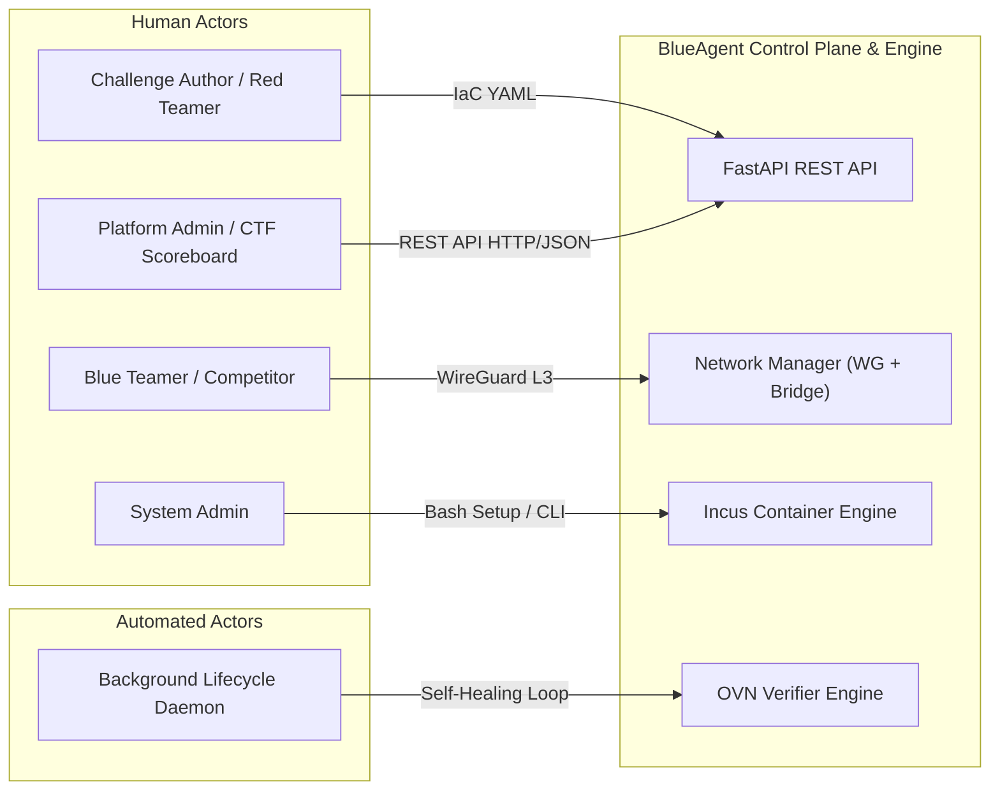
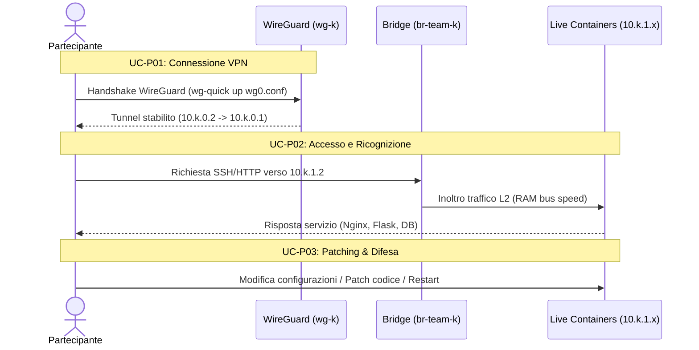
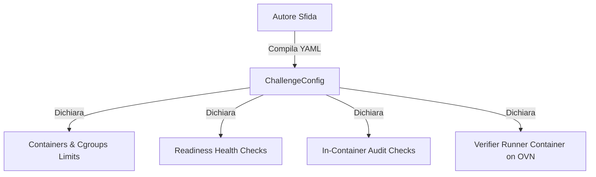
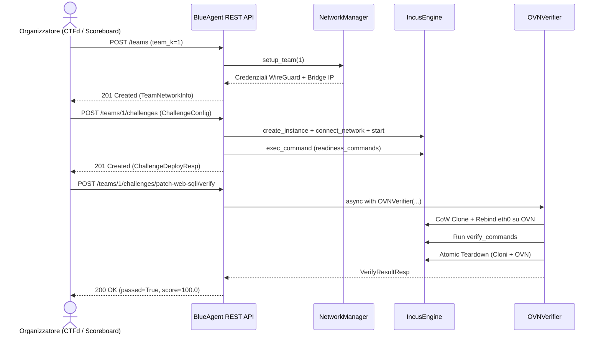
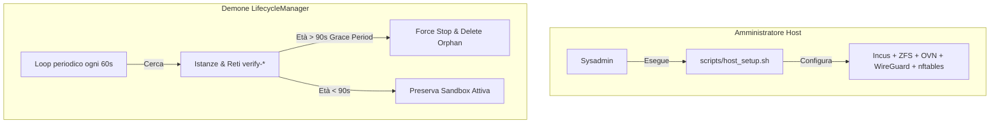

# BlueAgent v2 — Use Cases Grouped by Actors

> Comprehensive catalog of all system use cases for the **BlueAgent v2** automated Cyber Range platform, grouped by their primary actors, complete with technical mechanisms, related endpoints, and requirement traceability.

---

## 1. System Actors & Architecture

The BlueAgent platform distinguishes four distinct operational roles:

1. **Partecipante / Concorrente (Blue Teamer / Competitor)**: Connects via isolated WireGuard VPN to analyze live services, identify vulnerabilities, apply security patches, and inspect verification feedback.
2. **Autore della Sfida (Challenge Author / Red Teamer)**: Authors declarative Infrastructure-as-Code (IaC) YAML descriptors defining multi-container topologies, cgroup resource limits, boot readiness checks, and verification exploit scripts.
3. **Organizzatore di Gara / Piattaforma CTF (Platform Admin / Scoreboard)**: Orchestrates team lifecycle, deploys challenges, monitors real-time traffic, and triggers automated non-destructive verification via REST API.
4. **Amministratore di Sistema / Demoni Automatici (System Admin / Background Daemons)**: Provisions host bare-metal infrastructure (Incus, OVN, ZFS, WireGuard), continuously purges orphaned sandboxes via self-healing daemons, and monitors platform health probes.

---

## 2. Summary Catalog of Use Cases

| ID | Title | Actor | Scope / Interface | Related Requirements |
| :--- | :--- | :--- | :--- | :--- |
| **`UC-P01`** | Connessione sicura all'infrastruttura (WireGuard) | Partecipante (Blue Teamer) | VPN Tunnel (`wg-quick`, Cryptokey Routing) | `UR-ACC-01`, `SR-NET-01` |
| **`UC-P02`** | Accesso e ricognizione dei servizi applicativi | Partecipante (Blue Teamer) | Kernel Bridge (`br-team-k`, SSH/HTTP) | `UR-ACC-02`, `UR-ACC-03`, `SR-NET-02` |
| **`UC-P03`** | Applicazione di patch e contromisure difensive | Partecipante (Blue Teamer) | Target Container (`10.k.1.x`, code editing) | `UR-CHL-02`, `UR-VER-01`, `SR-ENG-04` |
| **`UC-P04`** | Consultazione dell'esito della verifica | Partecipante (Blue Teamer) | CTF UI / Scoreboard Dashboard | `UR-VER-04`, `SR-MOD-03` |
| **`UC-A01`** | Progettazione dichiarativa della sfida (IaC) | Autore Sfida (Red Teamer) | YAML Descriptor ([ChallengeConfig](file:///home/debian/blueagent/src/blueagent/models.py#L50)) | `UR-CHL-01`, `UR-CHL-02`, `SR-MOD-01`, `SR-MOD-02` |
| **`UC-A02`** | Allocazione delle quote di risorse (Cgroups) | Autore Sfida (Red Teamer) | Cgroups v2 (`limits_cpu`, `limits_memory`) | `UR-CHL-03`, `SR-ENG-05` |
| **`UC-A03`** | Definizione dei controlli di readiness (Health) | Autore Sfida (Red Teamer) | Boot probes (`readiness_commands`) | `UR-CHL-04`, `SR-CON-01` |
| **`UC-A04`** | Configurazione verifica In-Container (Audit) | Autore Sfida (Red Teamer) | Target: `container` (`exec_command`) | `UR-VER-03`, `SR-VRF-05` |
| **`UC-A05`** | Configurazione verifica Black-Box (Verifier Runner)| Autore Sfida (Red Teamer) | Target: `verifier` (Attacker container on OVN) | `UR-VER-02`, `UR-VER-03`, `SR-VRF-03` |
| **`UC-O01`** | Provisioning ambiente e VPN per un team | Organizzatore / CTFd | `POST /teams` | `UR-ORG-01`, `UR-ACC-01`, `SR-NET-01`, `SR-NET-02` |
| **`UC-O02`** | Ispezione dello stato del team | Organizzatore / CTFd | `GET /teams/{team_id}` | `UR-ORG-01`, `SR-CON-01` |
| **`UC-O03`** | Distribuzione e attivazione di una sfida | Organizzatore / CTFd | `POST /teams/{team_id}/challenges` | `UR-ORG-01`, `UR-CHL-02`, `SR-ENG-01`, `SR-ENG-05` |
| **`UC-O04`** | Elenco delle sfide attive per un team | Organizzatore / CTFd | `GET /teams/{team_id}/challenges` | `UR-ORG-01`, `SR-CON-01` |
| **`UC-O05`** | Esecuzione verifica automatizzata su OVN Sandbox | Organizzatore / CTFd | `POST /teams/{team_id}/challenges/{challenge_id}/verify` | `UR-VER-01`, `UR-VER-02`, `UR-VER-03`, `SR-VRF-01..04` |
| **`UC-O06`** | Ispezione e monitoraggio del traffico live | Organizzatore / Admin | Shell Host (`tcpdump -i br-team-k`) | `UR-ORG-02`, `UR-ACC-03`, `SR-NET-02` |
| **`UC-O07`** | Dismissione di una sfida per un team | Organizzatore / CTFd | `DELETE /teams/{team_id}/challenges/{challenge_id}` | `UR-ORG-01`, `SR-ENG-01`, `SR-CON-01` |
| **`UC-O08`** | De-provisioning e rilascio totale del team | Organizzatore / CTFd | `DELETE /teams/{team_id}` | `UR-ORG-01`, `UR-ORG-03`, `SR-NET-01`, `SR-NET-02` |
| **`UC-S01`** | Bootstrap e inizializzazione del nodo host | Amministratore di Sistema | [scripts/host_setup.sh](file:///home/debian/blueagent/scripts/host_setup.sh) | `SR-HST-01`, `SR-HST-02`, `SR-HST-03`, `SR-HST-04` |
| **`UC-S02`** | Bonifica automatica sandbox orfane (Self-Healing)| Demone Automatico ([LifecycleManager](file:///home/debian/blueagent/src/blueagent/lifecycle/manager.py#L14))| Async Background Worker (Grace Period 90s) | `UR-ORG-03`, `SR-CON-03`, `SR-VRF-04` |
| **`UC-S03`** | Monitoraggio e diagnostica della piattaforma | Amministratore / Monitor | `GET /health` | `SR-CON-04`, `SR-ENG-02` |

---

## 3. Detailed Use Cases Grouped by Actor

### Actor Group 1: Partecipante / Concorrente (Blue Teamer)

#### `UC-P01`: Connessione sicura all'infrastruttura di gara (WireGuard)
* **Attore Primario**: Partecipante (Blue Teamer).
* **Obiettivo**: Stabilire una connessione L3 cifrata e diretta verso l'infrastruttura del proprio team.
* **Precondizioni**: Il partecipante ha scaricato il file `wg0.conf` dalla dashboard CTF.
* **Flusso Operativo**:
  1. Il partecipante avvia WireGuard localmente (`wg-quick up wg0.conf`).
  2. Il client effettua l'handshake con l'interfaccia host `wg-k` (`10.k.0.1`).
  3. Il kernel host applica il Cryptokey Routing associando la chiave pubblica all'indirizzo `10.k.0.2/32`.
* **Postcondizioni**: La rotta per `10.k.0.0/16` è attiva e il gateway del team `10.k.1.1` è raggiungibile a bassa latenza.
* **Componenti Coinvolti**: Modulo kernel WireGuard, [NetworkManager.setup_team](file:///home/debian/blueagent/src/blueagent/network/manager.py#L74).
* **Requisiti Tracciati**: `UR-ACC-01`, `SR-NET-01`.

#### `UC-P02`: Accesso e ricognizione dei servizi applicativi live
* **Attore Primario**: Partecipante (Blue Teamer).
* **Obiettivo**: Raggiungere i container della sfida per esaminare servizi esposti, porte e sorgenti applicativi.
* **Precondizioni**: Tunnel WireGuard attivo; sfida distribuita e pronta.
* **Flusso Operativo**:
  1. Il partecipante invia comandi di rete (`curl http://10.k.1.2:8080`, `ssh root@10.k.1.2`).
  2. Il traffico attraversa `wg-k` e transita direttamente sul bridge Linux non gestito `br-team-k`.
  3. L'interfaccia `eth0` del container riceve i frame e risponde a velocità nativa di bus.
* **Postcondizioni**: Il partecipante acquisisce piena visibilità dei servizi e delle porte esposte.
* **Componenti Coinvolti**: Bridge `br-team-k`, Profilo Incus `team-k-profile`.
* **Requisiti Tracciati**: `UR-ACC-02`, `UR-ACC-03`, `SR-NET-02`.

#### `UC-P03`: Applicazione di patch e contromisure difensive
* **Attore Primario**: Partecipante (Blue Teamer).
* **Obiettivo**: Mitigare le vulnerabilità rilevate (sanificazione input, SQL Injection, hardening privilegi, patch codice).
* **Precondizioni**: Accesso al container di interesse (`10.k.1.x`).
* **Flusso Operativo**:
  1. Il partecipante modifica i file sorgente o i file di configurazione nel filesystem persistente del container.
  2. Riavvia o ricarica i demoni applicativi (`systemctl restart webapp`).
  3. Verifica in locale la reattività del servizio modificato.
* **Postcondizioni**: Lo stato del container live riflette le modifiche e le patch difensive.
* **Componenti Coinvolti**: Storage CoW ZFS `blueagent-zfs`, [IncusEngine](file:///home/debian/blueagent/src/blueagent/engine/incus.py#L17).
* **Requisiti Tracciati**: `UR-CHL-02`, `UR-VER-01`, `SR-ENG-04`.

#### `UC-P04`: Consultazione dell'esito della verifica
* **Attore Primario**: Partecipante (Blue Teamer).
* **Obiettivo**: Ricevere riscontro dettagliato sulla validità delle patch applicate e sul punteggio assegnato.
* **Precondizioni**: Verifica scatenata dalla piattaforma o dal concorrente.
* **Flusso Operativo**:
  1. Il partecipante visualizza sulla dashboard di gara l'esito del check (`passed=True/False`).
  2. In caso di fallimento, consulta il log sintetico (es. servizio non risponde o exploit ancora funzionante).
  3. In caso di successo, riceve l'accredito dei punti della challenge.
* **Postcondizioni**: Il team adegua la propria strategia difensiva in base all'esito.
* **Componenti Coinvolti**: Modello [VerifyResultResp](file:///home/debian/blueagent/src/blueagent/models.py#L77), Scoreboard CTF.
* **Requisiti Tracciati**: `UR-VER-04`, `SR-MOD-03`.

---

### Actor Group 2: Autore della Sfida (Challenge Author / Red Teamer)

#### `UC-A01`: Progettazione dichiarativa della sfida (IaC)
* **Attore Primario**: Autore della Sfida (Red Teamer).
* **Obiettivo**: Formalizzare uno scenario multi-tier in un file YAML riutilizzabile e versionabile.
* **Precondizioni**: Immagini di base preparate (es. tramite Distrobuilder o repository Incus).
* **Flusso Operativo**:
  1. L'autore compila il file YAML (es. [patch-web-sqli.yaml](file:///home/debian/blueagent/challenges/patch-web-sqli.yaml)).
  2. Definisce `challenge_id`, titolo, descrizione, container e suffissi IP (`ip_suffix: 2`, `ip_suffix: 3`).
* **Postcondizioni**: Specifica validata tramite lo schema Pydantic v2 [ChallengeConfig](file:///home/debian/blueagent/src/blueagent/models.py#L50).
* **Componenti Coinvolti**: [ChallengeConfig.from_yaml](file:///home/debian/blueagent/src/blueagent/models.py#L65).
* **Requisiti Tracciati**: `UR-CHL-01`, `UR-CHL-02`, `SR-MOD-01`, `SR-MOD-02`.

#### `UC-A02`: Allocazione delle quote di risorse (Cgroups Limits)
* **Attore Primario**: Autore della Sfida (Red Teamer).
* **Obiettivo**: Imporre limiti massimi deterministici di CPU e memoria RAM a ogni container.
* **Precondizioni**: File YAML in fase di stesura.
* **Flusso Operativo**:
  1. L'autore configura `limits_cpu` (es. `"1"`) e `limits_memory` (es. `"256MB"`).
  2. BlueAgent mappa le quote direttamente nella configurazione dell'istanza Incus (`limits.cpu`, `limits.memory`).
* **Postcondizioni**: I container operano entro limiti hardware certi impedendo saturazioni dell'host.
* **Componenti Coinvolti**: [ContainerSpec](file:///home/debian/blueagent/src/blueagent/models.py#L20), cgroups v2 del kernel.
* **Requisiti Tracciati**: `UR-CHL-03`, `SR-ENG-05`.

#### `UC-A03`: Definizione dei controlli di readiness (Health Checks)
* **Attore Primario**: Autore della Sfida (Red Teamer).
* **Obiettivo**: Dichiarare controlli preliminari di boot prima che la sfida venga aperta ai concorrenti.
* **Precondizioni**: Container della sfida definiti nel file YAML.
* **Flusso Operativo**:
  1. L'autore compila la lista `readiness_commands` specificando container target, comando (`cmd`) e timeout.
  2. Esempi: ping del database (`mysqladmin ping`) o controllo HTTP interno (`curl -s http://127.0.0.1:8080/health`).
* **Postcondizioni**: Il deployment convalida che tutti i check ritornino exit code 0 prima di dichiarare la challenge `"ready"`.
* **Componenti Coinvolti**: [CommandSpec](file:///home/debian/blueagent/src/blueagent/models.py#L11), [api/challenges.py](file:///home/debian/blueagent/src/blueagent/api/challenges.py#L76-L95).
* **Requisiti Tracciati**: `UR-CHL-04`, `SR-CON-01`.

#### `UC-A04`: Configurazione della verifica in modalità In-Container
* **Attore Primario**: Autore della Sfida (Red Teamer).
* **Obiettivo**: Validare file, permessi e integrità di patch locali senza richiedere traffico di rete esterno.
* **Precondizioni**: Specifica della sfida aperta.
* **Flusso Operativo**:
  1. L'autore imposta una voce in `verify_commands` con `target: "container"`.
  2. Specifica il nome del container target (es. `"server"`) e il comando di audit da lanciare.
* **Postcondizioni**: Il motore di verifica eseguirà il comando direttamente nel clone del container via `exec_command`.
* **Componenti Coinvolti**: [OVNVerifier](file:///home/debian/blueagent/src/blueagent/verifier/ovn.py#L102), [IncusEngine.exec_command](file:///home/debian/blueagent/src/blueagent/engine/incus.py#L161).
* **Requisiti Tracciati**: `UR-VER-03`, `SR-VRF-05`.

#### `UC-A05`: Configurazione della verifica in modalità Black-Box (Verifier Runner)
* **Attore Primario**: Autore della Sfida (Red Teamer).
* **Obiettivo**: Testare vulnerabilità da remoto replicando la prospettiva di un attaccante esterno sulla medesima rete L2.
* **Precondizioni**: Specifica della sfida aperta.
* **Flusso Operativo**:
  1. L'autore configura la sezione `verifier:` nello YAML (immagine OCI/Incus, quote, timeout).
  2. Aggiunge voci in `verify_commands` con `target: "verifier"` contenenti comandi di attacco o exploit.
* **Postcondizioni**: Il verifier istanzierà un runner container effimero agganciato allo switch logico OVN per condurre il test.
* **Componenti Coinvolti**: [VerifierSpec](file:///home/debian/blueagent/src/blueagent/models.py#L42), [OVNVerifier](file:///home/debian/blueagent/src/blueagent/verifier/ovn.py#L74-L88).
* **Requisiti Tracciati**: `UR-VER-02`, `UR-VER-03`, `SR-VRF-03`.

---

### Actor Group 3: Organizzatore di Gara / Piattaforma CTF (Platform Admin / Scoreboard)

#### `UC-O01`: Provisioning ambiente e VPN per un team
* **Endpoint**: `POST /teams` ([teams.py:L18](file:///home/debian/blueagent/src/blueagent/api/teams.py#L18))
* **Attore Primario**: Organizzatore di Gara / CTFd.
* **Obiettivo**: Allocare l'infrastruttura di rete dedicata e isolata per la squadra $k$.
* **Flusso Operativo**:
  1. La piattaforma invia `POST /teams` con payload `{"team_k": 1}`.
  2. BlueAgent acquisisce il lock per `team-1`.
  3. Crea il bridge Linux `br-team-1` (`10.1.1.1/24`), il tunnel WireGuard `wg-1` e il profilo Incus.
  4. Genera la configurazione WireGuard client `wg0.conf`.
* **Postcondizioni**: Risposta HTTP 201 con credenziali VPN e parametri di rete.
* **Componenti Coinvolti**: [NetworkManager](file:///home/debian/blueagent/src/blueagent/network/manager.py#L74), [LockRegistry](file:///home/debian/blueagent/src/blueagent/locks.py#L14).
* **Requisiti Tracciati**: `UR-ORG-01`, `UR-ACC-01`, `SR-NET-01`, `SR-NET-02`, `SR-CON-01`.

#### `UC-O02`: Ispezione dello stato del team
* **Endpoint**: `GET /teams/{team_id}` ([teams.py:L57](file:///home/debian/blueagent/src/blueagent/api/teams.py#L57))
* **Attore Primario**: Organizzatore di Gara / CTFd.
* **Obiettivo**: Verificare lo stato operativo e la connettività delle interfacce del team.
* **Flusso Operativo**:
  1. Invia `GET /teams/{team_id}`.
  2. Il sistema controlla lo stato up/down di `br-team-k`, la presenza dell'interfaccia WireGuard e il profilo Incus.
* **Postcondizioni**: Risposta JSON indicante lo stato di salute e la configurazione di rete attiva.
* **Requisiti Tracciati**: `UR-ORG-01`, `SR-CON-01`.

#### `UC-O03`: Distribuzione e attivazione di una sfida
* **Endpoint**: `POST /teams/{team_id}/challenges` ([challenges.py:L42](file:///home/debian/blueagent/src/blueagent/api/challenges.py#L42))
* **Attore Primario**: Organizzatore di Gara / CTFd.
* **Obiettivo**: Istanziare i container del challenge e renderli disponibili sulla rete live del team.
* **Flusso Operativo**:
  1. Invia `POST /teams/{team_id}/challenges` con la specifica [ChallengeConfig](file:///home/debian/blueagent/src/blueagent/models.py#L50).
  2. Crea i container su Incus con limiti CPU/RAM configurati.
  3. Assegna l'IP statico deterministico `10.{team_id}.1.{suffix}` sulla scheda `eth0` collegata a `br-team-{id}`.
  4. Avvia i container ed esegue i controlli di readiness.
* **Postcondizioni**: Risposta HTTP 201 [ChallengeDeployResp](file:///home/debian/blueagent/src/blueagent/api/challenges.py#L19) con stato `"ready"`.
* **Componenti Coinvolti**: [IncusEngine](file:///home/debian/blueagent/src/blueagent/engine/incus.py#L75-L115), [LockRegistry](file:///home/debian/blueagent/src/blueagent/locks.py#L14).
* **Requisiti Tracciati**: `UR-ORG-01`, `UR-CHL-02`, `SR-ENG-01`, `SR-ENG-05`, `SR-CON-01`.

#### `UC-O04`: Elenco delle sfide attive per un team
* **Endpoint**: `GET /teams/{team_id}/challenges` ([challenges.py:L114](file:///home/debian/blueagent/src/blueagent/api/challenges.py#L114))
* **Attore Primario**: Organizzatore di Gara / CTFd.
* **Obiettivo**: Consultare la lista delle sfide correntemente attive per un team.
* **Flusso Operativo**:
  1. Invia `GET /teams/{team_id}/challenges`.
  2. Riceve l'elenco dei challenge registrati con i relativi container attivi.
* **Postcondizioni**: Risposta JSON con le sfide in esecuzione.
* **Requisiti Tracciati**: `UR-ORG-01`, `SR-CON-01`.

#### `UC-O05`: Esecuzione verifica automatizzata su OVN Sandbox
* **Endpoint**: `POST /teams/{team_id}/challenges/{challenge_id}/verify` ([verify.py:L20](file:///home/debian/blueagent/src/blueagent/api/verify.py#L20))
* **Attore Primario**: Organizzatore di Gara / CTFd.
* **Obiettivo**: Validare le patch senza interferire con la produzione viva del team e senza side-channel leaks.
* **Flusso Operativo**:
  1. Riceve `POST /teams/{team_id}/challenges/{challenge_id}/verify`.
  2. Acquisisce il lock esclusivo del team per serializzare l'operazione.
  3. Istanzia una rete effimera SDN OVN (`verify-{session_id}`).
  4. Clona i container live via snapshot CoW ZFS (~100 ms) e ri-lega la scheda `eth0` allo switch OVN conservando l'IP (`10.k.1.x`).
  5. Avvia facoltativamente il container verifierrunner e lancia i test di exploit/audit.
  6. Al termine, distrugge in ordine inverso cloni e rete OVN garantendo pulizia atomica.
* **Postcondizioni**: Risposta HTTP 200 con modello [VerifyResultResp](file:///home/debian/blueagent/src/blueagent/models.py#L77) contenente esito, score e log.
* **Componenti Coinvolti**: [OVNVerifier](file:///home/debian/blueagent/src/blueagent/verifier/ovn.py#L12), [IncusEngine](file:///home/debian/blueagent/src/blueagent/engine/incus.py#L117).
* **Requisiti Tracciati**: `UR-VER-01`, `UR-VER-02`, `UR-VER-03`, `UR-VER-04`, `SR-VRF-01..05`.

#### `UC-O06`: Ispezione e monitoraggio del traffico live
* **Interfaccia**: Terminale Host Linux CLI (`tcpdump`)
* **Attore Primario**: Organizzatore / Platform Admin.
* **Obiettivo**: Ispezionare il traffico live dei partecipanti a scopo di audit, replay di gara o rilevamento abusi.
* **Flusso Operativo**:
  1. L'amministratore si collega alla shell del nodo bare-metal.
  2. Esegue `tcpdump -nn -i br-team-k` per catturare i pacchetti in chiaro a velocità nativa L2.
* **Postcondizioni**: Traccia PCAP registrata senza impatto prestazionale sul container o interferenze SDN.
* **Componenti Coinvolti**: Bridge kernel `br-team-k`.
* **Requisiti Tracciati**: `UR-ORG-02`, `UR-ACC-03`, `SR-NET-02`.

#### `UC-O07`: Dismissione di una sfida per un team
* **Endpoint**: `DELETE /teams/{team_id}/challenges/{challenge_id}` ([challenges.py:L133](file:///home/debian/blueagent/src/blueagent/api/challenges.py#L133))
* **Attore Primario**: Organizzatore di Gara / CTFd.
* **Obiettivo**: Eliminare i container di una specifica sfida liberando risorse CPU/RAM, mantenendo attivo il team.
* **Flusso Operativo**:
  1. Invia `DELETE /teams/{team_id}/challenges/{challenge_id}`.
  2. Incus arresta ed elimina tutti i container associati alla sfida.
  3. La sfida viene rimossa dal registro attivo del team.
* **Postcondizioni**: Risorse hardware liberate per il nodo host.
* **Componenti Coinvolti**: [IncusEngine.delete_instance](file:///home/debian/blueagent/src/blueagent/engine/incus.py#L107).
* **Requisiti Tracciati**: `UR-ORG-01`, `SR-ENG-01`, `SR-CON-01`.

#### `UC-O08`: De-provisioning e rilascio totale del team
* **Endpoint**: `DELETE /teams/{team_id}` ([teams.py:L76](file:///home/debian/blueagent/src/blueagent/api/teams.py#L76))
* **Attore Primario**: Organizzatore di Gara / CTFd.
* **Obiettivo**: Smantellare completamente l'ambiente di gara del team $k$ al termine dell'evento.
* **Flusso Operativo**:
  1. Invia `DELETE /teams/{team_id}`.
  2. Elimina i container rimanenti, l'interfaccia `wg-k`, il bridge `br-team-k` e il profilo Incus.
* **Postcondizioni**: Host completamente ripulito da tutte le interfacce e configurazioni del team.
* **Componenti Coinvolti**: [NetworkManager.teardown_team](file:///home/debian/blueagent/src/blueagent/network/manager.py#L105).
* **Requisiti Tracciati**: `UR-ORG-01`, `UR-ORG-03`, `SR-NET-01`, `SR-NET-02`, `SR-CON-01`.

---

### Actor Group 4: Amministratore di Sistema / Demoni Automatici (System Admin / Background Daemons)

#### `UC-S01`: Bootstrap e inizializzazione del nodo host
* **Attore Primario**: Amministratore di Sistema (Sysadmin).
* **Strumento**: [scripts/host_setup.sh](file:///home/debian/blueagent/scripts/host_setup.sh)
* **Obiettivo**: Predisporre l'host Debian 13 per l'orchestrazione ibrida (Linux Bridge + OVN SDN).
* **Flusso Operativo**:
  1. L'amministratore lancia `./scripts/host_setup.sh` con privilegi `sudo`.
  2. Installa e configura Incus, Open vSwitch, OVN (`ovn-central`, `ovn-host`), ZFS, WireGuard e nftables.
  3. Abilita l'IP forwarding permanente in `/etc/sysctl.d/99-blueagent.conf`.
  4. Inizializza lo storage pool ZFS `blueagent-zfs`.
  5. Espone il DB OVN Northbound (`tcp:127.0.0.1:6641`) e configura i range OVN su `incusbr0`.
* **Postcondizioni**: Host pronto ad avviare il backend FastAPI di BlueAgent.
* **Requisiti Tracciati**: `SR-HST-01`, `SR-HST-02`, `SR-HST-03`, `SR-HST-04`.

#### `UC-S02`: Bonifica automatica delle sandbox orfane (Self-Healing)
* **Attore Primario**: Demone Automatico ([LifecycleManager](file:///home/debian/blueagent/src/blueagent/lifecycle/manager.py#L14)).
* **Obiettivo**: Eliminare container e reti OVN residui generati da crash imprevisti del server o timeout di verifica.
* **Flusso Operativo**:
  1. A intervalli regolari (default ogni 60s), il demone esamina tutte le istanze e le reti con prefisso `verify-`.
  2. Calcola l'età della risorsa confrontandola con il periodo di grazia (default 90s).
  3. Se l'età supera il grace period, forza l'arresto e la cancellazione delle risorse orfane.
* **Postcondizioni**: Bonifica autonoma continua con zero memory leak o storage exhaustion.
* **Componenti Coinvolti**: [LifecycleManager.prune_orphaned_sandboxes](file:///home/debian/blueagent/src/blueagent/lifecycle/manager.py#L42).
* **Requisiti Tracciati**: `UR-ORG-03`, `SR-CON-03`, `SR-VRF-04`.

#### `UC-S03`: Monitoraggio e diagnostica della piattaforma
* **Endpoint**: `GET /health` ([main.py:L63](file:///home/debian/blueagent/src/blueagent/main.py#L63))
* **Attore Primario**: Amministratore di Sistema / Sonda di Monitoraggio (Prometheus, UptimeRobot).
* **Obiettivo**: Valutare in tempo reale lo stato del socket Unix Incus e il funzionamento del worker di background.
* **Flusso Operativo**:
  1. Il sistema di monitoraggio esegue `GET /health`.
  2. L'endpoint effettua una chiamata ping sul socket `/var/lib/incus/unix.socket` e controlla lo stato del LifecycleManager.
  3. Risponde con HTTP 200 `{"status": "healthy", "incus": "connected"}` oppure HTTP 503 se degradato.
* **Postcondizioni**: Diagnostica immediata della disponibilità della piattaforma.
* **Componenti Coinvolti**: [main.py](file:///home/debian/blueagent/src/blueagent/main.py#L63), [IncusEngine](file:///home/debian/blueagent/src/blueagent/engine/incus.py#L20).
* **Requisiti Tracciati**: `SR-CON-04`, `SR-ENG-02`.

---

## 4. Requirement Traceability Matrix (UC ↔ Requirements)

| Use Case ID | User Requirements (UR) | System Requirements (SR) | Architectural Mechanism |
| :--- | :--- | :--- | :--- |
| **`UC-P01`** | `UR-ACC-01` | `SR-NET-01`, `SR-HST-01` | WireGuard `wg-k` cryptokey routing on `10.k.0.2/32` |
| **`UC-P02`** | `UR-ACC-02`, `UR-ACC-03` | `SR-NET-02`, `SR-NET-05` | Direct L2 access via unmanaged `br-team-k` kernel bridge |
| **`UC-P03`** | `UR-CHL-02`, `UR-VER-01` | `SR-ENG-04`, `SR-HST-02` | State modifications preserved on CoW ZFS storage pool |
| **`UC-P04`** | `UR-VER-04` | `SR-MOD-03` | Structured verification response payload |
| **`UC-A01`** | `UR-CHL-01`, `UR-CHL-02` | `SR-MOD-01`, `SR-MOD-02` | Declarative Pydantic v2 YAML parser |
| **`UC-A02`** | `UR-CHL-03` | `SR-ENG-05` | Cgroups v2 `limits.cpu` and `limits.memory` enforcement |
| **`UC-A03`** | `UR-CHL-04` | `SR-CON-01`, `SR-ENG-05` | Boot verification sequence before marking challenge ready |
| **`UC-A04`** | `UR-VER-03` | `SR-VRF-05` | Direct in-replica execution via Incus `exec_command` |
| **`UC-A05`** | `UR-VER-02`, `UR-VER-03` | `SR-VRF-03` | Ephemeral attacker container attached to OVN Geneve overlay |
| **`UC-O01`** | `UR-ORG-01`, `UR-ACC-01` | `SR-NET-01`, `SR-NET-02` | Automated allocation of `wg-k`, `br-team-k`, and Incus profile |
| **`UC-O02`** | `UR-ORG-01` | `SR-CON-01` | Link state probe of team interfaces and profiles |
| **`UC-O03`** | `UR-ORG-01`, `UR-CHL-02` | `SR-ENG-01`, `SR-ENG-05` | Container instantiation, deterministic IP binding, and readiness run |
| **`UC-O04`** | `UR-ORG-01` | `SR-CON-01` | Active challenge registry lookup |
| **`UC-O05`** | `UR-VER-01`..`04` | `SR-VRF-01`..`05` | Dark OVN sandbox, ~100ms CoW snapshot, dual-mode execution |
| **`UC-O06`** | `UR-ORG-02`, `UR-ACC-03` | `SR-NET-02` | Zero-overhead packet sniffing via host `tcpdump` |
| **`UC-O07`** | `UR-ORG-01` | `SR-ENG-01`, `SR-CON-01` | Challenge-specific container teardown |
| **`UC-O08`** | `UR-ORG-01`, `UR-ORG-03` | `SR-NET-01`, `SR-NET-02` | Complete team teardown and interface de-allocation |
| **`UC-S01`** | N/A | `SR-HST-01`..`04` | Idempotent bash provisioning script |
| **`UC-S02`** | `UR-ORG-03` | `SR-CON-03`, `SR-VRF-04` | Periodic self-healing worker with 90s grace period |
| **`UC-S03`** | N/A | `SR-CON-04`, `SR-ENG-02` | Live Incus UDS ping and lifecycle task status probe |
